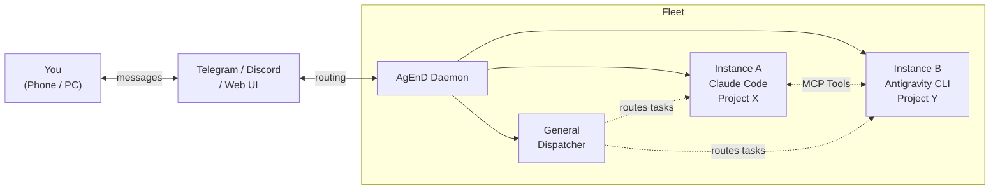

<p align="center">
  <h1 align="center">AgEnD</h1>
  <p align="center">
    <strong>Run a fleet of AI coding agents from your phone.</strong>
  </p>
  <p align="center">
    <a href="https://songsid.github.io/AgEnD"></a>
    <a href="https://www.npmjs.com/package/@songsid/agend"></a>
    <a href="LICENSE"></a>
    <a href="https://nodejs.org">= 22.14.0"></a>
  </p>
</p>

AgEnD (**Agent Engineering Daemon**) turns your Telegram or Discord into a command center for AI coding agents. One bot, multiple CLI backends, unlimited projects — each running as an independent session with crash recovery and zero babysitting.

<p align="center">
  <code>You → Telegram/Discord → AgEnD → Fleet of AI Agents → Results back to your phone</code>
</p>

[繁體中文](README.zh-TW.md) · [Documentation](docs/features.md) · [CLI Reference](docs/cli.md)

---

## Why AgEnD?

| Without AgEnD | With AgEnD |
|---|---|
| Close the terminal, agent goes offline | Runs as a system service — survives reboots |
| One terminal = one project | One bot, unlimited projects running in parallel |
| Long-running sessions accumulate stale context | CLI auto-compact + crash recovery with context snapshots |
| No idea what your agents are doing overnight | Daily cost reports + hang detection alerts |
| Agents work in silos, can't coordinate | Peer-to-peer collaboration via MCP tools |
| Runaway costs from unattended sessions | Per-instance daily spending limits with auto-pause |

## Feature Highlights

🚀 **Fleet Management** — One bot, N projects. Each Telegram forum topic or Discord channel is an isolated agent session.

🔄 **Multi-Backend** — Claude Code, Codex, OpenCode, Kiro CLI, Antigravity CLI, Grok Build, Meta Muse Code. Switch or mix freely.

🤝 **Agent Collaboration** — Agents discover, wake, and message each other via MCP tools. A General Topic routes tasks to the right agent using natural language.

📱 **Mobile Control** — Approve tool use, restart sessions, and manage your fleet from Telegram or Discord buttons.

🛡️ **Autonomous & Safe** — Cost guards, hang detection, model failover, and crash recovery keep your fleet running without babysitting.

⏰ **Persistent Schedules** — Cron-based tasks backed by SQLite. Survives restarts.

🎤 **Voice Messages** — Talk to your agents with Groq Whisper transcription.

📄 **HTML Chat Export** — Export any agent session as a self-contained HTML file for sharing or archiving.

🪞 **Mirror Topic** — Cross-instance visibility. Watch another agent's work in real time from a separate topic.

🛑 **Cancel Button** — Interrupt agent generation with a single tap. Inline button appears on every message; works across TG and Discord.

📬 **Delivery Status** — Each message you send gets a reaction that tracks it: on Discord 👀 received → ⏳ queued → 👀 with the agent → ✅ delivered, or ❌ if delivery failed. Telegram only accepts its own reaction set, so there it is 👀 throughout and 👎 on failure.

🎨 **Configurable Status Emoji** — Every delivery-status emoji can be changed per channel or per instance with `status_emojis`, including Discord server emoji. See [Configuration](docs/configuration.md#channeloptionsstatus_emojis-discord-and-telegram).

🖥️ **Web Dashboard** — Live fleet monitoring in the browser with SSE updates and integrated chat UI.

🔌 **Extensible** — Adapter plugins, webhook notifications, health endpoint, external session support via IPC.

👥 **Teams & Task Board** — Named groups for targeted broadcasting. Shared task board for multi-step work tracking across instances.

📋 **Fleet Templates** — Define reusable fleet configurations. Deploy multi-instance setups with one command, each with its own git worktree.

😀 **Stickers & Persona Emoji** — Agents can send stickers on Discord and Telegram, and each agent can pick its own emoji so you can tell bots apart in a shared channel.

📊 **Subscription Usage** — `/usage` (also the dashboard and the `get_usage` tool) shows the remaining quota of your Claude, Codex, Kiro, Grok, Muse and Antigravity subscriptions, one row per subscription.

🔑 **Credential Profiles** — Run instances, or ClassicBot channels, on a second subscription of the same backend with `backend_options.<backend>.credential_profile` (kiro-cli and Codex today). See [Configuration](docs/configuration.md#credential-profiles-multiple-subscriptions-of-one-backend).

🌐 **Sign In From Your Phone** — `/login` (fleet admins) signs a CLI in without SSH: device-code logins such as Codex and Grok post their link and code in the chat, and a sign-in that needs a terminal gets a time-limited, token-protected browser terminal on the host. For kiro-cli and Claude Code it can also open a temporary public link through a Cloudflare Quick Tunnel after you confirm; AgEnD downloads `cloudflared` if it is missing. Turn it off with `web_terminal.tunnel.allow_public: false`. See [Configuration](docs/configuration.md#finishing-a-login-away-from-the-machine-public-link).

💤 **Auto-Pause & Wake** — With `auto_pause_after` (minutes, off by default) an idle instance is paused and wakes by itself when a message arrives. `/pause` and `/wake` do the same by hand.

🧠 **Memory Pressure Guard** — On Linux the fleet watches host memory: under pressure it slows new CLI starts, holds them while memory is critical, and posts a notice. On macOS the readings are only logged.

## Use Cases

AgEnD is an AI personal assistant that lives in Discord and Telegram, running on the AI subscriptions you already have.

- **Work** — one channel per project; message from your phone, the assistant works on your machine and reports back. A General channel routes tasks, and assistants delegate to each other.
- **Everyday life** — DM your assistant to look things up, ask about a photo, or set a reminder.
- **Outward-facing contact point** — a ClassicBot in a partner or customer group answers from your docs and asks an internal assistant when it needs more.
- **Player showcase** — users have brought their assistants into friends' groups, with several bots in one channel and even a shared social feed.

See [Use Cases](docs/use-cases.md) for real examples, everyday tips and who it's for.

## Quick Start

One-liner (macOS / Linux — installs Node.js via nvm + tmux + agend, then runs quickstart):

```bash
curl -fsSL https://songsid.github.io/AgEnD/install.sh | bash
```

Or install manually:

```bash
npm install -g @songsid/agend    # 1. Install
agend quickstart                # 2. Setup — bot token, backend, done
agend fleet start               # 3. Launch your fleet 🎉
```

Open Telegram or Discord, send a message to your bot, and start working from your phone.

> **Discord?** `agend quickstart` supports Discord too — it's built in, no extra install needed. See [Discord setup guide](docs/features.md#discord-adapter).

## How It Works



1. **You send a message** to your Telegram/Discord bot
2. Messages sent to the **General Topic** are interpreted and routed to the right agent. Messages to a specific topic go directly to that instance.
3. **Agent instances** run in isolated tmux sessions, each with its own project and CLI backend
4. **Agents collaborate** peer-to-peer via MCP tools — delegating tasks, sharing context, reporting results
5. **Results flow back** to your chat. Permission requests arrive as inline buttons.

## Supported Backends

| Backend | Install | Auth |
|---------|---------|------|
| Claude Code | `curl -fsSL https://claude.ai/install.sh \| bash` | `claude` (OAuth) or `ANTHROPIC_API_KEY` |
| OpenAI Codex | `curl -fsSL https://chatgpt.com/codex/install.sh \| sh` | `codex` (ChatGPT login) or `OPENAI_API_KEY` |
| OpenCode | `curl -fsSL https://opencode.ai/install \| bash` | `opencode` (configure provider) |
| Kiro CLI | `curl -fsSL https://cli.kiro.dev/install \| bash` | `kiro-cli login` (AWS Builder ID) |
| Antigravity CLI | `curl -fsSL https://antigravity.google/cli/install.sh \| bash` | `agy` (Google Sign-In) |
| Grok Build | `curl -fsSL https://x.ai/cli/install.sh \| bash` | `grok` (x.ai OAuth device flow). Needs CLI 1.0.13 or later; run `grok update` if the server refuses an older one |
| Meta Muse Code | `mkdir -p "$HOME/.local/bin" && curl -fsSL https://api.meta.ai/muse-launcher.sh -o "$HOME/.local/bin/muse" && chmod +x "$HOME/.local/bin/muse" && MUSE_LAUNCHER_INSTALL=1 "$HOME/.local/bin/muse"` (the launcher keeps its binary beside itself, so it is saved first) | `muse login` |

**Or install from chat with `/login <backend>`** (beta, fleet admins only), without SSH-ing into the host: when the CLI is not installed yet, `/login` runs the command above in a fleet window, finds the CLI where its installer put it, adds that directory to the fleet's PATH, and goes on to sign in. A bare `/login` offers every backend above.

**Tested CLI versions (AgEnD 2.1.9).** Codex 0.155 to 0.159. Claude Code 2.1.286 (first-run, trust and resume screens captured from the real CLI). Kiro CLI 2.21 to 2.27 run live; older 2.x versions still start, with a warning to update, and anything newer than 2.27 is launched only after its own `--help` confirms the flags AgEnD pins (the legacy UI on kiro's v1 engine, the terminal UI on v2). A kiro-cli that can no longer run an instance that way is refused, not started on another engine (#1109). `kiro_ui: v3` is not supported yet (#849). Grok CLI 1.0.13 or later. Muse 1.3.0. Antigravity and OpenCode have no pinned version. Other versions usually work, but a new CLI release can change its screens, so AgEnD only claims a version after testing against it.

## Requirements

- Node.js ^22.14.0 || ^23.6.0 || >=24
- tmux
- One of the supported AI coding CLIs (installed and authenticated)
- Telegram bot token ([@BotFather](https://t.me/BotFather)) or Discord bot token
- Groq API key (optional, for voice)

> **⚠️** All CLI backends run with `--dangerously-skip-permissions` (or equivalent). See [Security](docs/SECURITY.md).

> **Codex:** each instance resumes the conversation recorded for its own working directory, so instances on git worktrees of one repository no longer take each other's sessions. See [Codex session resume](docs/features.md#codex-session-resume).

> **WSL (Windows Subsystem for Linux):** Fully supported. The install script auto-detects WSL and avoids using Windows `node.exe` from PATH. If you encounter PATH issues, add to `/etc/wsl.conf`:
> ```ini
> [interop]
> appendWindowsPath=false
> ```
> Then restart WSL (`wsl --shutdown`). Install with: `curl -fsSL https://songsid.github.io/AgEnD/install.sh | bash`

> **Native Windows** is not supported: the `agend` and `agend-agent` commands are POSIX `sh` launchers, and AgEnD runs its instances in tmux. On Windows, install and run AgEnD inside WSL.

## Documentation

- [Use Cases](docs/use-cases.md) — what people do with AgEnD, with real examples
- [Features](docs/features.md) — detailed feature documentation
- [CLI Reference](docs/cli.md) — all commands and options
- [Configuration](docs/configuration.md) — fleet.yaml complete reference
- [Security](docs/SECURITY.md) — trust model and hardening
- [Development Setup](docs/development.md) — working on AgEnD itself

## ClassicBot

ClassicBot lets users start AI agents in any Discord text channel using slash commands — no forum topics required. On Telegram, `/start` in a private chat or `/start@yourbot` in a group does the same.

### Setup

```bash
# 1. Run quickstart (select Discord — built in, no extra install)
agend quickstart

# 2. Start the fleet
agend fleet start
```

The quickstart will set up both `fleet.yaml` and `classicBot.yaml`. Run `agend quickstart` again to add users or guilds to existing config.

### Usage

| Command | Who | Description |
|---------|-----|-------------|
| `/start <backend>` | see below | Start an agent in the current channel |
| `/chat <message>` | anyone | Send a message to the agent |
| `/steer`, `/btw`, `/cancel`, `/ctx` | anyone | Interject into the current task, ask a side question, interrupt, show context usage |
| `/pause`, `/wake`, `/compact`, `/clear`, `/model`, `/save` | admin | Pause or wake the agent, compact or clear its context, switch model, save the conversation |
| `/effort`, `/collab` | admin | Discord only: reasoning effort, collab mode |
| `/stop`, `/load` | ClassicBot admin | Stop the agent in the current channel; load a saved conversation (`/load` is Discord only) |

"Admin" is a fleet admin or a ClassicBot admin (`admin_users`) on Discord. On Telegram, `/pause`, `/wake`, `/compact` and `/save` take a ClassicBot admin. Fleet-wide commands such as `/usage` and `/status` also work in a ClassicBot channel on Discord. Who may `/start`: on Discord, anyone in an allowed server; on Telegram, a user in `allowed_users` in a private chat, or a ClassicBot admin in an allowed group (`/start@yourbot`).

On Discord, `/start` turns on collab mode: @-mention the bot to talk to it. See [Use Cases](docs/use-cases.md) for examples.

### Server Whitelist

Control which Discord servers can use ClassicBot via `~/.agend/classicBot.yaml`:

```yaml
defaults:
  backend: claude-code
  allowed_guilds:              # Only these servers can /start
    - "123456789012345678"
    - "9876543210123456789"
```

- **Empty or omitted** `allowed_guilds` → all servers allowed (default)
- **Primary guild** (fleet.yaml `group_id`) → full access (topic mode + ClassicBot)
- **Whitelisted guilds** → ClassicBot channels only
- **A `/start` from a server that is not listed** posts an approval request with buttons to the General topic
- **Hot reload** — changes detected every 30 seconds, no restart needed

### Per-Channel Backend

Override the backend for specific channels:

```yaml
defaults:
  backend: claude-code
channels:
  "1234567890":               # Discord channel ID
    name: dev-help
    backend: kiro-cli          # Override for this channel
```

Backend fallback: channel → `defaults.backend` → `fleet.yaml` defaults → `claude-code`

### Access Lists

```yaml
defaults:
  allowed_guilds: ["123456789012345678"]   # Discord servers (empty = all)
  allowed_groups: ["-1001234567890"]       # Telegram groups (empty = all)
  allowed_users: ["123456789"]             # Telegram users who may /start in a private chat (empty = all)
  admin_users: ["123456789"]               # ClassicBot admins (empty = nobody)
```

Quote the ids: a Discord id is too long to survive as a YAML number. With no `admin_users`, nobody can `/stop` a ClassicBot agent and nobody can start one in a Telegram group.

### Second Subscription per Channel

A channel can run on a different login of the same backend, as a fleet instance can:

```yaml
channels:
  "1234567890":
    backend: kiro-cli
    backend_options:
      kiro-cli:
        credential_profile: work   # "" = back to the shared login
```

The channel's `backend_options` are merged over the fleet.yaml defaults'. Profiles work for kiro-cli and Codex; an invalid profile name keeps the agent from starting rather than running it on the wrong account, and a change restarts a running agent. Log the profile in first: see [Credential profiles](docs/configuration.md#credential-profiles-multiple-subscriptions-of-one-backend). Every other `classicBot.yaml` key is in the [Configuration reference](docs/configuration.md#classicbotyaml).

## Known Limitations

- macOS (launchd) and Linux (systemd) supported; on Windows, run it inside WSL ([Windows install guide](https://songsid.github.io/AgEnD/install-windows/)). Native Windows is not supported
- Official Telegram plugin in global `enabledPlugins` causes 409 polling conflicts

## License

MIT
