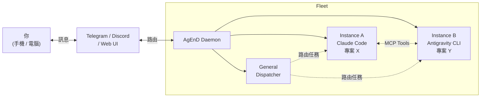

<p align="center">
  <h1 align="center">AgEnD</h1>
  <p align="center">
    <strong>用手機管理一整個 AI coding agent 團隊。</strong>
  </p>
  <p align="center">
    <a href="https://www.npmjs.com/package/@songsid/agend"></a>
    <a href="LICENSE"></a>
    <a href="https://nodejs.org">= 20"></a>
  </p>
</p>

AgEnD（**Agent Engineering Daemon**）把你的 Telegram 或 Discord 變成 AI coding agent 的指揮中心。一個 bot，多種 CLI 後端，無限專案 — 每個都是獨立 session，crash 自動恢復，不用顧。

<p align="center">
  <code>你 → Telegram/Discord → AgEnD → AI Agent 團隊 → 結果回到你的手機</code>
</p>

[English](README.md) · [功能文件](docs/features.md) · [CLI 參考](docs/cli.md)

---

## 為什麼用 AgEnD？

| 沒有 AgEnD | 有 AgEnD |
|---|---|
| 關掉終端機，agent 就斷線 | 系統服務常駐，重開機也不怕 |
| 一個終端機 = 一個專案 | 一個 bot，無限專案同時跑 |
| 長時間 session 累積過時 context | 依 max age 自動輪替 session，保持新鮮 |
| 不知道 agent 半夜在幹嘛 | 每日花費報告 + 卡住偵測通知 |
| Agent 各做各的，無法協作 | 點對點協作，透過 MCP tools |
| 無人看管時帳單暴增 | 每個 instance 每日花費上限，自動暫停 |

## 功能亮點

🚀 **Fleet 管理** — 一個 bot、N 個專案。每個 Telegram Forum Topic 就是獨立的 agent session。

🔄 **多後端支援** — Claude Code、Codex、OpenCode、Kiro CLI、Antigravity CLI、Grok Build、Meta Muse Code，自由切換或混用（Gemini CLI 已於 2026-06-18 停用）。

🤝 **Agent 協作** — Agent 之間透過 MCP tools 互相發現、喚醒、傳訊。General Topic 用自然語言把任務路由到對的 agent。

📱 **手機操控** — 從 Telegram inline 按鈕核准工具使用、重啟 session、管理整個 fleet。

🛡️ **自主又安全** — 花費上限、卡住偵測、model failover、context 輪替，fleet 不用顧也能穩穩跑。

⏰ **持久化排程** — cron 排程任務，SQLite 儲存，重啟不遺失。

🎤 **語音訊息** — 用 Groq Whisper 轉文字，用說的跟 agent 溝通。

📄 **HTML 對話匯出** — 把任何 agent session 匯出成獨立 HTML 檔，方便分享或存檔。

🪞 **Mirror Topic** — 跨 instance 可見性。從另一個 topic 即時觀看其他 agent 的工作。

🖥️ **Web Dashboard** — 瀏覽器即時 fleet 監控，SSE 更新 + 整合聊天介面。

🔌 **可擴充** — Discord adapter、webhook 通知、health endpoint、外部 session 透過 IPC 連入。

## 開始用

一行安裝（macOS / Linux — 自動裝 Node.js（經 nvm）+ tmux + agend，完成後跑 quickstart）：

```bash
curl -fsSL https://songsid.github.io/AgEnD/install.sh | bash
```

或手動安裝：

```bash
npm install -g @songsid/agend    # 1. 安裝
agend quickstart                # 2. 設定 — bot token、backend，搞定
agend fleet start               # 3. 啟動 fleet 🎉
```

打開 Telegram，傳訊息給你的 bot，開始用手機寫 code。

## 運作原理



1. **你傳訊息**給 Telegram/Discord bot
2. 傳到 **General Topic** 的訊息會被解讀並路由到對的 agent。傳到特定 topic 的訊息則直接送到該 instance。
3. **Agent instance** 在獨立的 tmux session 跑，各有自己的專案和 CLI 後端
4. **Agent 之間協作** — 透過 MCP tools 委派任務、分享 context、回報結果
5. **結果回傳**到你的聊天室。權限請求以 inline 按鈕呈現。

## 支援的後端

| Backend | 安裝 | 認證 |
|---------|------|------|
| Claude Code | `curl -fsSL https://claude.ai/install.sh \| bash` | `claude`（OAuth）或 `ANTHROPIC_API_KEY` |
| OpenAI Codex | `curl -fsSL https://chatgpt.com/codex/install.sh \| sh` | `codex`（ChatGPT 登入）或 `OPENAI_API_KEY` |
| Gemini CLI | `npm i -g @google/gemini-cli` | `gemini`（Google OAuth）⚠️ 2026-06-18 起已停用 |
| OpenCode | `curl -fsSL https://opencode.ai/install \| bash` | `opencode`（設定 provider） |
| Kiro CLI | `curl -fsSL https://cli.kiro.dev/install \| bash` | `kiro-cli login`（AWS Builder ID） |
| Antigravity CLI | `curl -fsSL https://antigravity.google/cli/install.sh \| bash` | `agy`（Google Sign-In） |
| Grok Build | `curl -fsSL https://x.ai/cli/install.sh \| bash` | `grok`（x.ai OAuth device flow）。CLI 需 1.0.13 以上，舊版會被伺服器拒絕，請執行 `grok update` |
| Meta Muse Code | `mkdir -p "$HOME/.local/bin" && curl -fsSL https://api.meta.ai/muse-launcher.sh -o "$HOME/.local/bin/muse" && chmod +x "$HOME/.local/bin/muse" && MUSE_LAUNCHER_INSTALL=1 "$HOME/.local/bin/muse"`（launcher 會把 binary 放在自己旁邊，所以要先存檔） | `muse login` |

**也可以在聊天室用 `/login <backend>` 安裝**（beta、僅限 fleet 管理員），不必 SSH 進主機：CLI 還沒安裝時，`/login` 會在 fleet 視窗執行上表的指令，到安裝程式實際放置的位置找到 CLI，把那個目錄加進 fleet 的 PATH，然後接著登入。單獨輸入 `/login` 會列出上表除了 Gemini CLI 以外的所有 backend（`/login gemini-cli` 仍可安裝它）。

**已測試的 CLI 版本（AgEnD 2.1.9）**：Codex 0.155 到 0.159；Claude Code 2.1.286（首次啟動、trust、resume 畫面都從真實 CLI 擷取）；Kiro CLI 2.21 到 2.27 實際跑過；更舊的 2.x 仍可啟動，但會提醒更新；比 2.27 更新的版本，要先用它自己的 `--help` 確認 AgEnD 鎖定的參數（legacy UI 搭 kiro 的 v1 engine、terminal UI 搭 v2）還在才會啟動。若 kiro-cli 已無法這樣執行某個 instance，AgEnD 會拒絕啟動，不會換成別的 engine 執行（#1109）。`kiro_ui: v3` 尚未支援（#849）；Grok CLI 1.0.13 以上；Muse 1.3.0。Antigravity 與 OpenCode 沒有釘定版本。其他版本通常也能用，但 CLI 新版可能改動畫面，所以 AgEnD 只在實測過後才宣稱支援某個版本。

## 系統需求

- Node.js >= 20
- tmux
- 以下任一 AI coding CLI（需安裝並完成認證）
- Telegram bot token（[@BotFather](https://t.me/BotFather)）或 Discord bot token
- Groq API key（選用，語音轉文字用）

> **⚠️** 所有 CLI 後端都以 `--dangerously-skip-permissions`（或等效參數）執行。詳見 [Security](docs/SECURITY.zh-TW.md)。

> **Codex：** 每個 instance 恢復的是記錄在自己工作目錄下的對話，同一個 git repo 的不同 worktree 上的 instance 不再互搶 session。詳見 [Codex session 恢復](docs/features.zh-TW.md#codex-session-恢復-codex-session-resume)。

## 文件

- [Features](docs/features.md) — 功能詳細說明
- [CLI Reference](docs/cli.md) — 所有指令與選項
- [Configuration](docs/configuration.zh-TW.md) — fleet.yaml 完整設定參考
- [Security](docs/SECURITY.zh-TW.md) — 信任模型與安全強化
- [開發環境設定](docs/development.md) — 開發 AgEnD 本身

## 已知限制

- 支援 macOS（launchd）和 Linux（systemd），不支援 Windows
- 全域 `enabledPlugins` 裡有官方 Telegram plugin 會造成 409 polling 衝突
- OpenCode 和 Kiro CLI 不讀取 MCP server 的 `instructions` 欄位 — fleet context 和 workflow template 不會注入到這些 backend 的 system prompt。等待上游修復。
- Gemini CLI 自 2026-06-18 起停用 — 請改用 Antigravity CLI（`agy`）

## 授權

MIT
