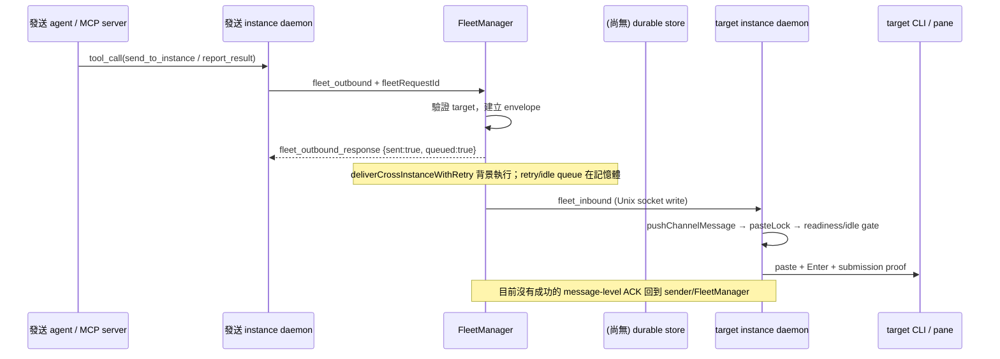

# #929 Durable Outbox 設計

**狀態：設計稿，尚未實作。**
**基準：** `origin/main` `eb634771b292a4860178601e5290e08251f233a2`。
**範圍：** #926、#927 與 fleet→instance 訊息投遞失敗的完整呈現。

## 決策摘要

1. 在 FleetManager 與 instance daemon 之間增加一個由 FleetManager 擁有的 SQLite durable delivery queue。入列 transaction commit 後才能回覆「已接受」；`events.db` 不作為工作佇列。
2. 一筆 delivery 在 target daemon 回報既有投遞路徑的正面 submission proof 前，都保持未完成。socket write 成功只算傳輸嘗試，不算 delivered。
3. 使用穩定 `delivery_id` 重播同一筆工作，並以 sender invocation key 防止同一個 IPC 請求重複建列。保持 `correlation_id` 作為任務關聯欄位，**不能**把它當唯一鍵。
4. crash 恰好發生在 CLI 已收訊息、但成功 ACK 還沒持久化時，不能承諾真正 exactly-once。用 `uncertain` 狀態做 pane reconciliation；無法證明時不要盲目重送，持久記錄並明確通知，交由操作人決定是否 replay。
5. 先把所有經 FleetManager `deliverToInstance()` 的 agent-directed payload 納入同一個 dispatcher（一般 inbound、cross-instance、`report_result`、broadcast、schedule trigger 及 system notice）；控制面 IPC（查詢、設定、回覆 MCP tool call）不進 outbox。`raw_paste` 等繞過 facade 的訊息路徑需在實作前改接或明確列為不保證 durable。

## 1. 現況與靜默遺失點

### Cross-instance 主路徑



目前各段的實際行為：

- `src/channel/mcp-server.ts` 的 `ipcRequest()` 把 tool call 送給 instance daemon，等待 requestId response；逾時或 IPC disconnect 會回傳 tool error。這代表結果可能未知，不代表必然沒送出；MCP request pending map 是 process-local。
- `src/daemon.ts` 把 cross-instance tools 以 `fleet_outbound` 廣播給 FleetManager，並在 `pendingIpcRequests` 記憶體 map 等 `fleet_outbound_response`。daemon timeout 時回錯誤；FleetManager 若已開始工作但 response 丟失，呼叫端重試可能造成第二筆邏輯訊息。
- `src/outbound-handlers.ts` 的 `sendToInstance()` 會同步拒絕不存在、停止或 crash-loop target；通過後就以 `void deliverCrossInstanceWithRetry(...)` 背景投遞，隨即回 `{ sent: true, queued: true, correlation_id }`。`report_result`、`delegate_task`、`request_information` 都經 `wrapAsSend()` 走同一路徑。`report_result` 的 correlation_id 目前可省略（會 warning），且同一 correlation 可以有多則合法訊息。
- 同一 handler 的 retry 預設為首次嘗試加 3 次重試、每次間隔 30 秒。promise、attempt count 和最終結果都只在目前 FleetManager 記憶體中；FleetManager process 被 systemd/service 重啟時，未完成 retry 消失。
- `src/fleet-manager.ts` 的 `deliverToInstance()` 以 `idleGatedDeliveryTails`、`ipcWaitTails` 在記憶體中保持每個 target 的順序、等待 idle 和短暫 IPC reconnect。target daemon 的 `pasteLock`、`steerLock` 也在該 daemon process 內。任一相關 process 重啟都會失去尚未完成的 queue/tail。
- `IpcClient.send()`（`src/channel/ipc-bridge.ts`）回 `true` 的定義是 `socket.write()` 沒有同步失敗；這不是 target daemon 已 parse payload、已將工作排入 paste queue，更不是 CLI 已收到訊息的 ACK。`deliverToInstance()` 因此可能在 target 隨即死亡時正常 resolve。
- target daemon 收到 `fleet_inbound` 後以 `wake().then(pushChannelMessage)` 排入本地 `pasteLock`。queued work、delivery epoch 和鎖都在記憶體中。明確的失敗 verdict 會送 `cross_instance_delivery_failed`，但 target daemon 在 queue 尚未完成時被殺不會執行 catch/failure callback。
- `src/daemon.ts` 有 inbound channel message 的 `message_queued/delivered/confirmed/failed` 事件；跨 instance meta 的 `chat_id` 為空，這些平台 reaction 並非 cross-instance end-to-end receipt。cross-instance 成功沒有對應的 durable result。
- `cross_instance_delivery_failed` 目前依 target daemon 仍能廣播到 FleetManager；FleetManager 寫 `events.db`、通知 sender topic，再 best-effort 把失敗文字排回 sender。sender IPC 不在、後續 `deliverToInstance()` 拒絕或 adapter 發文失敗時，最多留 logger warning，沒有 durable failure-notice queue。
- `events.db` 是 history/activity log，`EventLog` 為 optional；FleetManager 明確會在它損毀時移開並重建，仍繼續啟動。它會 prune，也沒有 delivery lease/replay 狀態，因此不能承擔可靠佇列。`scheduler.db` 有排程、decision、task 等資料，並非 cross-instance 工作表。
- `broadcast` 是每個 target 各自呼叫同一個記憶體 retry helper；response 的 `sent_to` 代表已排入背景呼叫，並非每個 target 已收到。各 target 結果沒有持久的 per-recipient status。
- `send_to_instance` 的 handler 執行期間遇 MCP/IPC timeout 會明確回錯誤，不會把 timeout 本身判成功；缺口在於 timeout 可能和背景投遞同時發生，造成「呼叫端不知道、底層仍可能送達」的 ambiguous outcome。target IPC socket write 回 true 則更進一步被當作投遞呼叫成功，但仍沒有 receiver ACK。

### 其他 agent-directed 路徑

一般 topic inbound 與 web/API inbound 也會經 FleetManager→`deliverToInstance()`；收到平台訊息時有些 status reaction 會先於 CLI submission。因此它們也會受 FleetManager crash 或 target daemon crash 影響。排程 trigger 同樣走 facade。silent schedule 的 `raw_paste` 目前直接 `ipc.send()`，是 facade 外的重要缺口。設計建議先統一所有持久 agent work 的提交 facade；若第一版只做 cross-instance，必須把這些路徑標成明確不保證，不能由「durable outbox」名稱暗示已涵蓋。

## 2. Durable store 與資料模型

### 儲存選擇

新增獨立 `delivery-outbox.db`，位於既有 AgEnD `DATA_DIR`（預設 `~/.agend/delivery-outbox.db`，或 `$AGEND_HOME/delivery-outbox.db`），由 FleetManager 單一 process 寫入，使用既有 `better-sqlite3`。建議 `journal_mode=WAL`、`synchronous=FULL`、小幅 `busy_timeout`（專用單寫入者，避免同步 SQLite call 長時間卡住 event loop），資料檔及目錄沿用私有權限（新建檔 `0600`）。所有 DB transaction 短小同步；不得在 transaction 內等待 idle、IPC、sleep 或外部 adapter。

- **不放 `events.db`：** 它是可丟棄歷史記錄且損毀時會被重建，不能當唯一工作副本。
- **不放 `scheduler.db`：** 避免把即時 delivery 熱路徑和排程/decision/task schema、CLI 存取及 migration 綁在一起；也讓 outbox DB 損壞可被獨立隔離與診斷。
- DB 不可開啟、寫入失敗或磁碟滿時，**不得 fallback 到記憶體 queue 並回成功**。拒絕新的 durable admission、回清楚錯誤並發出 fleet-level alert；未完成 rows 不得自動 rename/reset。這和 `events.db` 的容錯策略刻意不同。

### 建議 schema

`deliveries`（一個 target 一列；broadcast 拆成每個 target 一列）：

| 欄位 | 用途 |
|---|---|
| `delivery_id TEXT PRIMARY KEY` | Fleet 在首次 commit 時產生 UUID；每次 retry/replay 不變。 |
| `source_key TEXT UNIQUE` | 去重一次 source invocation，例如 source daemon boot UUID + fleetRequestId + target。不同 invocation 即使 correlation 相同仍是不同列。 |
| `source_instance`, `source_session` | 回報給原發送 agent/session。 |
| `target_instance`, `target_session` | target daemon 與 external session 定址。 |
| `kind`, `request_kind`, `correlation_id` | 原 tool/event 類型和工作關聯；correlation 可空且不作 unique key。 |
| `source_message_key` | 平台 inbound 可用 adapter/world + platform message ID + target 去重；MCP invocation 使用 source_key。 |
| `payload_json` | 已定址、已完成附件轉換且可重播的 IPC envelope；不可依賴 process temp file。 |
| `state` | `queued / delivering / submission_started / retry_wait / delivered / failed / uncertain / cancelled`。 |
| `attempt_count`, `next_attempt_at`, `lease_owner`, `lease_until` | crash recoverable 的 dispatcher lease/backoff。 |
| `created_at`, `updated_at`, `accepted_at`, `submitted_at`, `finished_at` | audit 與 queue latency。 |
| `last_error_phase`, `last_error_code`, `last_error_safe` | 不包含 access token/完整 secret 的 diagnostic。 |
| `notification_state`, `notice_attempts` | terminal failure notice 是否已可靠排出/送達。 |

可加 `delivery_attempts` append-only 表記每次 target generation、開始/結束、結果及 error phase；主要狀態仍以 `deliveries` 為準，attempt log 不作恢復依據。加上 `(target_instance,state,created_at)`、`state,next_attempt_at` 索引。

`source_key` 不用 `correlation_id`：MCP invocation 使用 `(source daemon boot UUID, fleetRequestId, target)`，同一個 request 的 transport retry 沿用；`broadcast` 為同一 source request 的每個 target 各有 key；平台訊息使用 `(adapter_id, source platform, chat/message ID, target)`。Daemon 每次 process 啟動產生新的 boot UUID，避免 process-local `fleetRequestSeq` 重設後撞到舊列。Correlation 只是任務/對話關聯，一個 delegated task 可有多個 progress/report delivery。

### 狀態語意

```text
queued → delivering → retry_wait → queued   (可重試的 pre-submit failure)
                    ↘ failed                 (確定的 permanent failure)
                    ↘ submission_started → delivered
                                         ↘ failed      (只在 negative proof 後)
                                         ↘ uncertain   (side-effect 結果未知)
queued/delivering → cancelled   (只有明確 cancel)
```

- `queued`：payload 已在 SQLite transaction commit。這是 `send_to_instance`/`report_result` 可回覆的 durable acceptance。
- `delivering`：worker 取得有期限 lease，正在做 target wake、idle gate、IPC 和 pane proof；其他 worker 不得同時派同一筆。
- `submission_started`：target 已向 FleetManager 要求開始不可原子化的 pane side-effect，FleetManager 已先 transaction commit 此狀態並回 begin-ACK；target 只能在收到此 ACK 後 paste/Enter。這是 crash recovery 的不確定性邊界。
- `delivered`：target daemon 對同一 `delivery_id` 回報其既有 `deliverMessage()` positive submission proof 成功（native queue 的成功 handoff 沿用目前定義）。socket write 或收到 `fleet_inbound` 單獨不能令列完成。
- `retry_wait`：明確、可重試的 transient failure，含 `next_attempt_at`；不建立新的 delivery_id。
- `failed`：確定不可能成功或有界 retry/TTL 用盡。保留 payload/診斷並建立 failure notice 工作，不能只 log。
- `uncertain`：crash 落在非交易性的 pane write 和 durable success ACK 之間，reconciliation 無法判明。不可自動盲目 replay；明確呈現「可能已投遞」，供操作者 inspect/replay。
- `cancelled`：只用於使用者明確取消的未提交工作。正常 stop/restart、process shutdown 不可把它改成 cancelled。

明確 cancel 應在 FleetManager DB transaction 中將該 target 上尚未到 `submission_started` 的列改 `cancelled`，並讓 in-memory waiter 觀察同一個 terminal state；restart 不靠只存在記憶體的 delivery epoch 判斷舊列是否還有效。已到 `submission_started` 的 side-effect 不可假裝可撤銷，需保留 terminal outcome 或標明 uncertain。

## 3. Commit、replay 與重複防護

1. FleetManager 收到 envelope 後，完成同步 validation、定址和大小檢查，產生 `delivery_id` 及 source key。target 不存在、禁止或 payload 過大等既有永久錯誤仍同步回 MCP error，不能先入列。取代目前 `deliverCrossInstanceWithRetry()` 的獨立背景 retry promise；同一 dispatcher/row 是唯一 retry owner。
2. 用一個 SQLite transaction insert `queued` row。若 `source_key` 已存在，回既有 delivery_id/state，**不可插第二筆**。只有 commit 成功後才回 `{sent:true, queued:true, durable:true, delivery_id, delivery_state:"queued", correlation_id}`。這保留既有欄位，並將「sent」語意明確化為已持久接受。
3. 單一 FleetManager dispatcher 在啟動後先掃描未完成列，再開放/消費新的訊息來源。全域 concurrency 有上限；每個 target 同時最多一筆，依 DB sequence FIFO，target 間並行。idle gate、wake 和 backoff 都在 transaction 外等待。
4. 取得 row 時以 transaction 將 `queued`→`delivering`、寫 `lease_owner=manager_boot_id` 和 `lease_until`；commit lease 後才送 IPC。只要不是 `delivered/failed/cancelled`，entry 就不能被 pruning。
5. IPC envelope 帶不可變 `delivery_id` 和 `source_key`。target daemon 對同一 ID 維持單一 in-flight item；同 generation 收到重複 IPC 時回報既有進度，不再把 payload 塞兩次 `pasteLock`。`delivery_epoch` 的明確 cancel 仍可使尚未開始 submission 的工作轉 `cancelled`。
6. target dequeue 後、paste/Enter 前，先以 `delivery_id`、target daemon generation 和當前 epoch 發 `delivery_begin` 給 FleetManager。FleetManager transaction 將 row 改為 `submission_started` 後回 `delivery_begin_ack`；target 未收到成功 ACK 不得做 pane side-effect，留在 queue 等待或回報 retryable failure。這讓「pane write 可能已發生」先於 side-effect 持久化。
7. target 以帶 `delivery_id` 的 progress/terminal ACK 回報 `queued/submitted/delivered/failed`。FleetManager 檢查 delivery ID、target 名稱、target daemon generation，並 transaction 寫狀態；舊 daemon generation 的遲到 ACK 不得完成新一輪狀態。現有 human inbound `message_queued/delivered/confirmed/failed` 也應以同一 ID 對應 outbox row，避免 status path 和 delivery map 各自維護不完整的工具/事件對照表。
8. FleetManager process restart 時，所有舊 `manager_boot_id` lease 可安全回收；尚未到 `submission_started` 的 `delivering` rows 回 `queued`，以原 ID replay。重啟 target daemon 時也一樣：未開始 pane write 的工作安全重播，target queue 不再是唯一副本。
9. 若 last persisted progress 已到 `submission_started` 而沒有 terminal ACK，先以 stable inbound `message_id` / delivery marker 對 pane 作有限 reconciliation。找到正面 proof → `delivered`；有可靠負面 proof 且 target generation/window 有效 → `retry_wait` 原 ID；pane 已替換、無法讀取或證據模糊 → `uncertain` 並通知，不自行送第二份可能重複的工作。

**Exactly-once 限制：** SQLite transaction 無法和 tmux/CLI 的 Enter 在同一個原子 transaction 中 commit。可靠承諾應寫成「durable admission + at-least-once transport + stable-id dedupe + 對不可判定的 side-effect crash 明確標 uncertain」，不能聲稱絕對 exactly-once。若產品要求 `uncertain` 也一定自動恢復，就必須接受可能重複的語意，並由 leader 對任務重複執行風險作產品決定。

## 4. 各層 failure surface

| Failure boundary | 新行為 |
|---|---|
| Tool validation、target missing/stopped/crashed、payload limit | 原同步 tool error；不得回 durable acceptance。 |
| DB commit 前 FleetManager/IPC crash | source 收到明確 MCP/IPC error 或 timeout（outcome unknown 的 timeout 要標清）；沒有 `queued` ACK。呼叫端重試同一 operation key 時只會插一列。 |
| DB commit 後、MCP success response 前 crash | restart replay row；source 因 response lost 可能重送時，同 source key 回既有 row/id，不重複入列。 |
| target daemon restart / socket disconnect / busy idle gate | 保留 `queued/delivering`、lease expire/retry；不把 socket write 當成功。超出可重試範圍轉 terminal `failed` 並保留記錄。 |
| target paste proof 成功 | durable transition to `delivered`; 可發 status event，重複 ACK 冪等。 |
| target crash 在 submission 前 | 回收 delivery 並重播同 ID。 |
| target crash 在 submission 後、ACK 前 | pane reconciliation；不能證明時 `uncertain`，不是靜默刪除、也不是無條件再 paste。 |
| 失敗狀態通知 sender/session/topic | `delivery_id` + `correlation_id` + failure phase 的 notice row/job 持久重試；通知本身失敗仍顯示在 durable status/CLI/API。failure notice 的失敗不得遞迴再產生 failure notice。 |
| event log/metrics/webhook side-effect | 只是 mirror；不能決定 row 狀態或吞掉 outbox exception。狀態 transition 先 commit，再 best-effort 寫 `events.db`。 |
| DB unavailable/full disk/corrupt | admission fail closed；告警；保留原 DB/WAL 供人工恢復，不 rename/reset。已有 unfinished rows 不清。 |

失敗要同時有機器可查與人可見：`deliveries` 中 terminal row 是權威記錄；失敗 notice 經可重試的 notification queue 發給原 sender topic/session、target topic（適用時）及 General/operator channel。`report_result` 失敗必須帶原 `correlation_id`，使 pipeline owner 能對回 delegation。建議配套 `agend delivery list|show <delivery_id>|retry <delivery_id>` 或等價 dashboard/API：即使兩個 agent IPC 都不在、channel API 暫時失敗，值班者仍能找出結果。`retry` 明確建立新 attempt 或重新排舊 ID，不抹除歷史。

重試界線：保留現有 first attempt + 3 retries/30 秒作初期相容預設，並增加 crash/reconnect 時的 lease replay；對持續停機或超過最大 age 的 item 轉成**可見的** `failed`，而不是無限佔用 30 個 instance queue。正式值（例如最大 age、backoff、全域 worker 數）實作前以 30-instance 壓力資料校準。explicit `stop` 不等於取消已接受的工作；source/user cancel 才能終止尚未 submission 的 row。

## 5. 與現有 API 整合與相容遷移

- `send_to_instance`、`delegate_task`、`request_information`、`report_result` 仍使用既有 schema 和 request/response IPC；在 `sendToInstance()` 共用 admission 點持久化。`report_result` 的現有 optional correlation 欄位先維持相容；缺值警告繼續保留，新增的 `delivery_id` 解決單筆投遞辨識，兩者用途分離。
- `broadcast` 每個 target 各自 insert/status；partial failure 逐 target 回報，不可因一個 target 失敗丟掉其餘成功列。
- 正常 channel/web inbound 在 `deliverToInstance()` 入列；delivery status event 綁相同 ID。adapter ingest 必須在 ack/offset advance 前完成持久化；Webhook 應 commit 後才回成功，long-poll adapter 應只在 durable insert 後推進 offset。各 adapter 的 ack 語意需在實作 ticket 中逐一確認；無法重播的 source 必須清楚 surface DB 故障。若 provider 已在應用收到 event 前完成不可逆 ACK，FleetManager 無法補回尚未寫進本機 DB 的 event，需在 scope/保證中明列該 ingress gap。
- schedule trigger 保留 `schedule_id`/run id 作來源冪等鍵，避免 fleet restart catch-up 和 outbox replay產生兩次。silent schedule `raw_paste` 改走 durable envelope 或在第一版正式明列排除。
- tool result 的 `queued:true` 與既有 response fields 保留；只新增 `durable`, `delivery_id`, `delivery_state`。agent 不應把 enqueue 當成 target 已處理；失敗通知另行回傳。舊 daemon 可忽略未知 optional field，但新 FleetManager 不能接受「無 message-level ACK capability」的 target 為 delivered。
- 新舊 wire message 欄位採 additive/optional；需 capability handshake（例如 `delivery_ack_v1`）和版本化 message type。先確定 `fleet_inbound` 不會被舊 daemon 靜默忽略新 ID，否則只能標為 compatibility/degraded 並對 operator 發警示。
- 同一個 target 的 FIFO 與 idle gate 行為保留；cross-target 並行不變。原本的 synchronous validation、target wake、steer fallback、cancel semantics、過大 payload 拒絕均保留。
- 附件/臨時檔：入列前必須將 payload 化成重啟後可讀的內容。若 envelope 只存 temp path，則附件需搬到 outbox-owned blob area 並以 delivery_id 引用，terminal retention 後 GC；不能把過期 Discord CDN URL 或 process temp file 當 replay source。
- migration 是新 DB 的 versioned additive schema（`PRAGMA user_version`），不改 `events.db` 或 `scheduler.db`。既有記憶體 queue 無法回填；部署瞬間尚未完成的舊版 queue 仍有原風險，升級說明需揭露。新版本啟動時先開 store、recover leases、再啟動 dispatcher 和可能 ack input 的 adapters。
- 已完成 payload 保留短期 debug window（建議 7 日），之後刪 payload 但保留 ID、correlation、terminal outcome metadata（建議 30 日）；unfinished/uncertain/failure-notice rows 不自動刪。成功/失敗記錄不可洩漏完整錯誤、secret 或附件內容至 event log。

## 6. 失敗處置與 rollback

1. **Canary/功能閘：** 初版先只啟用 durable dispatcher，保留 `legacy` fallback 開關供故障隔離；監看 accepted→delivered latency、queued age、retry、uncertain、failure-notice backlog、SQLite busy/full。只有明確人工切到 legacy 才能不落 DB；工具回覆必須標 `durable:false`/degraded 並告警，絕不照常回 durable acceptance。
2. **停用或回退：** 先停止新的 durable admission/dispatcher，明確列出 pending count 和目標；不要刪 DB、不要把非終端 row 改成 success。若選擇回舊版，outbox rows 保留為 frozen；舊版不會讀它們，所以需提示 operator 尚有待處理項，不能宣稱已完成。回復新版後先做 inspect/reconcile 再 replay。
3. **schema rollback：** 不做 destructive down migration。部署前用 SQLite backup API 做一致性備份（涵蓋 WAL），記錄 `user_version`；舊版沒有新表也可忽略獨立 DB。若新版 migration 失敗，保留原檔與 WAL、阻止 admission 並報錯，不仿照 `events.db` 自動移走再建空 DB。
4. **dispatcher bug：** 將 feature flag 關閉只允許已確定安全的送件模式；對 `delivering` rows 按 lease/reconciliation 規則凍結或回 queued，絕不可批次標 delivered。提供人工按 ID inspect/retry/mark-done（需審計理由）的 recovery 指引。
5. **disk/volume protection：** 設 per-target/global pending count/bytes 上限；容量滿時新 delivery 明確拒絕、舊 pending 不淘汰。清理僅終端 payload；先告警並提供 export/backup。

## 7. 測試與必紅 mutation

### 必測情境

- Store transaction：insert、source-key duplicate 回同一 ID、atomic transition、commit 前 throw、migration 重複執行、WAL reopen、DB busy/full/corrupt 不會假成功。
- Fleet crash matrix：SIGKILL 模擬 commit 前/後、tool response 前/後、lease 寫入後、target socket write 前/後；重開 DB 後 row 恢復到正確狀態，沒有 unfinished row 被消失或假標 delivered。
- #927：target daemon 在 busy pane 有多筆 pasteLock queue 時退出，再啟動；已 durable accepted 的訊息依原 FIFO replay，每筆只入列一次；不可恢復/超時的條目有 `failed/uncertain` 並 surface 給 sender/operator。
- #926：worker `report_result` 經 leader IPC/idle gate；成功 ACK 到正確 `correlation_id`，或 leader 離線/restart/DB/IPC 失敗後，worker 與人類 operator 最終看到 durable failure，pipeline 不會只卡住。
- `send_to_instance` / `report_result` / wrappers / broadcast 多 target 的回應相容、idempotency 和 per-target partial failure；相同 correlation 的兩個 report 仍是兩筆不同 delivery。
- target shutdown/reconnect、paused wake、idle timeout、crash-loop、explicit cancel、planned FleetManager stop/restart、service auto-restart、舊 target daemon 缺 ACK capability。
- Crash after CLI submission but before DB ACK：以 message id pane proof reconcile；模糊證據轉 `uncertain` 且不盲貼第二次。
- Failure notice adapter 發送失敗、sender IPC 不存在、failure notice worker 重啟；通知可續送或在 `agend delivery` 查到，failure notice 不遞迴。
- 30 個 target 壓力測試：跨 target bounded parallel、每 target FIFO、單 target idle 不阻塞全隊；SQLite write lock 短且不在 idle wait 期間持有。
- Adapter source duplicate/replay，以 `adapter_id + platform message_id + destination` 去重；attachment replay 不依賴過期/暫存檔；schedule catch-up 不重複 fire。
- 所有 agent-directed message type / status event 使用 exhaustiveness map；新加 outbound kind 若沒有 delivery policy，typecheck/test 必須失敗，不能靜默漏到未處理 default。

### 必須能抓到的 mutation

1. 移除 outbox insert 或把 commit 移到 `queued:true` response 後：#927 crash-after-accept 測試必紅。
2. 把 `ipc.send() === true` 當 `delivered`：socket-write-then-target-crash/no-ACK 測試必紅。
3. restart 不回收舊 lease / 不恢復 queue pump：reopen DB 後 pending row stuck 測試必紅。
4. 每次 retry 產生新 `delivery_id`、刪掉 `source_key` unique guard 或 target duplicate guard：timeout/replay duplicate 測試必紅。
5. 舊 generation 的 ACK 可完成新 lease：stale-ACK-after-restart 測試必紅。
6. ambiguous `submission_started` 一律自動 replay：after-Enter-before-ACK 測試必紅（需得到 `uncertain`，不得第二次送 Enter）。
7. 把 `failed/uncertain` notice 丟給 logger/eventLog 後就刪除 row：#926 report_result failure/operator visibility 測試必紅。
8. sender/target notification reject 被吞掉但 `notification_state=sent`：notification retry/restart 測試必紅。
9. correlation_id 當 unique key：兩個合法同 correlation report 被合併的測試必紅。
10. 取消 `delivery_id` → human delivery status/`cross_instance_delivery_failed` 無法關聯正確 entry：delivery-map exhaustiveness 與 per-message correlation 測試必紅。

## 設計 review 需要拍板的點

1. #929 第一版是否涵蓋所有 `deliverToInstance()` payload（推薦），還是嚴限 cross-instance？如限縮，channel inbound、silent `raw_paste`、web/API、schedule trigger 需明確列為下一階段而非 durable。
2. CLI submission ACK 缺失且 pane proof 模糊時，推薦保守 `uncertain` + 人工 replay；是否接受相較盲目 at-least-once 重送可能需要人工介入？這是無法同時保證無遺失和無重複的 crash window。
3. 重試預設值/最長 age、terminal metadata 保留天數、全域 worker concurrency，需用約 30 instances 的壓力/恢復實測定值。
4. 若 `delivery-outbox.db` 無法寫入，是讓 fleet 的 adapter ingress 暫停/明確拒絕，還是保留非 durable legacy 模式並顯示 degraded badge？推薦 fail-closed，避免把記憶體入列偽裝成 durable acceptance。
