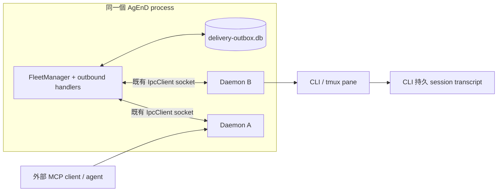

# #929 Durable Outbox 設計

**狀態：Phase 1 與 Phase 2 皆已在 main（CHANGELOG 2.1.7，#929 已關閉）。** Phase 2 的重啟後 reconciliation 見 `src/delivery-reconciliation.ts`（由 `src/instance-lifecycle.ts` 的 `capturePendingTargetReconciliation()` 呼叫）；silent-schedule `raw_paste` 已 durable admission 進 outbox（`src/fleet-manager.ts` 的 `schedule:…:raw_paste` source key 與 pump 端 `claimed.kind === "raw_paste"`）；`delivery_status` 查詢已提供（`src/outbound-handlers.ts`）。下文保留設計當時的寫法。
**設計基準：** `origin/main` `d1b43f63411de497d8917d4b8b09dcf27825a2ba`（Phase 2 authoring base；已包含請求時的 `b4101f66`）；FleetManager 與 instance daemon 由同一個 AgEnD Node process 管理。
**範圍：** #926、#927 與 FleetManager 接受的 agent-directed delivery。Phase 1 暫將 silent-schedule `raw_paste` 標為 non-durable；Phase 2 設計將其接入 outbox。

## 決策摘要

1. 在 FleetManager process 內使用單一 SQLite durable outbox。row commit 才能回覆 durable accepted；`events.db` 不作工作佇列。
2. FleetManager 和 `Daemon` 物件不是兩個獨立 process。`delivery_begin`、`delivery_abort`、delivery ACK 由同 process 直接呼叫 outbox，SQLite commit 完才返回；IpcClient/socket write 只負責既有 ingress/target 通訊，絕不代表投遞完成。
3. `mcp-server.ts` 在 CLI 端、`ipcRequest()` 前建立穩定 `operation_id`，並在 success/error/timeout 都回傳；它是 response-lost 後 status lookup 的 key。`correlation_id` 只關聯工作，可對應多筆合法訊息。
4. Fleet process 整體死亡後，先用持久 session transcript 及有順序保證的 pre-kill pane evidence reconciliation；在 pane-write fence/lock 下可證明尚未送 Enter 的 composer-only marker 是「已貼未提交」的負面證據，不是 delivered。沒有正面或可靠負面證據才標 `uncertain`，不可盲目重送。
5. begin 對 `(delivery_id, target_daemon_boot_id, attempt_no)` 冪等。side effect 尚未發生且能證明未發生時，必須以 `delivery_abort` 持久退回 queued/retry_wait。
6. queue admission、completion、failure 均 fail-closed 並有機器可查/人可見結果。status reaction 由 outbox row 狀態驅動；retry_wait 不顯示失敗。

## 1. 現況與實際失敗邊界

### Process 與訊息路徑

FleetManager 和多個 `Daemon` instance 都在**同一個 AgEnD OS process**。例如 `instance-lifecycle.ts` 建立 `new Daemon(...)`，FleetManager 經 `IpcClient` 連 daemon 的 Unix socket；該 socket 是同 process 元件間的現有通道，不代表 daemon 是另一個會獨立崩潰的 OS process。CLI pane/程序及外部 MCP client 才是獨立 process。



`send_to_instance` 與 `report_result` 的目前路徑：外部 MCP client → `mcp-server.ts` → source `Daemon` tool handler → `fleet_outbound` IPC → FleetManager `sendToInstance()` → 記憶體 `deliverCrossInstanceWithRetry()` → target `deliverToInstance()`/daemon socket → target `pushChannelMessage()`、`pasteLock`、readiness gate → CLI paste/Enter。`report_result`、`delegate_task`、`request_information` 透過 wrapper 使用同一 outbound handler。`broadcast` 對每個 target 各排一個記憶體工作。

目前會靜默遺失或留下模糊結果的點：

- **整個 AgEnD process 死亡（#927 主場景）**：FleetManager、所有 daemon 物件、`deliverCrossInstanceWithRetry()` promise、每個 target 的 IPC/idle tails、`pasteLock` 都一起消失。已回覆 queued 的記憶體工作沒有重播來源。
- **同 process 單一 Daemon 物件 stop/restart**：FleetManager 與 store 可存活，但該物件的 queue/epoch/鎖和 socket 失效。replacement daemon 是新物件，舊物件的遲到 callback/ACK 不能改新 generation 的 row。
- **FleetManager 直接 socket write 回 true**只證明 bytes 被本機 socket 接受，不代表 target parse、入 queue 或 CLI 收到。若 write 後 process 死，無 message-level ACK 可恢復。
- target daemon 收到 `fleet_inbound` 後，到 CLI submission proof 之間的 queue 只在記憶體；busy/idle wait、retry state 及最終 result 沒持久化。target/整個 process 結束時無法知道 message 是否已 paste。
- tool timeout/disconnect 會回 tool error，但若 FleetManager 已接受或 CLI 已提交，結果可能未知。agent 重新呼叫工具時是新 tool call、新 `fleetRequestId`，目前沒有任何 source key 可將它認成同一個意圖。
- `cross_instance_delivery_failed` 及回送 sender/topic 的通知依賴仍存活的 daemon、IPC 和 adapter；通知丟失最多留下 log。`events.db` 是可重建/可 prune 的 history，不是工作真相來源。
- `report_result` 的 correlation 可省略且非唯一；同一 correlation 下可能有多筆 progress/final report，不能用它當 delivery primary key。
- FleetManager 重啟時 `Daemon.start()` 會建立新 tmux window 並清理舊 window（目前 Strategy A）。因此重啟後的新 pane 不一定含舊畫面；只查新 pane scrollback 幾乎總是無證據。

### 其他 agent-directed 路徑

一般 topic inbound、web/API inbound、schedule trigger 也進 `deliverToInstance()`；delivery status event 有時早於 CLI submission。silent schedule `raw_paste` 目前直接 IPC，不經 facade。所有路徑須由下方 policy map 明列，不能因共用「送訊息」字樣而隱式落入 outbox 或假稱 durable。

## 2. Store、key 與狀態模型

### 持久化選擇

使用獨立 `delivery-outbox.db`，位於 AgEnD `DATA_DIR`（預設 `~/.agend` 或 `$AGEND_HOME`），以既有 `better-sqlite3` 由 FleetManager 單一 writer 管理。設定 `journal_mode=WAL`、`synchronous=NORMAL`、短 `busy_timeout`，database/目錄沿用私有權限，DB transaction 同步且短；禁止 transaction 期間等待 IPC、idle、sleep 或 adapter。

WAL + NORMAL 在**AgEnD process crash/restart**時保有已提交 transaction；OS crash/斷電時，最近 commit 可能尚未 fsync 到穩定媒體。若需求包含斷電後也不得丟已 ACK 的 admission，需選擇 admission transaction 使用 FULL，並驗證 SQLite/volume 實際同步語意。壓測需記錄每 delivery 的 transaction/同步次數、commit p50/p95/p99、event-loop stall 和 WAL checkpoint 時間。不要用 `events.db`（損毀時可重建且會 prune）或 `scheduler.db`（不同 schema/責任）作真相來源。

DB 開啟/寫入失敗、磁碟滿或 schema 不相容時，不可 fallback 到記憶體 queue 並回 `queued:true`。拒絕新 durable admission、保留 DB/WAL、發 fleet alert；未完成 row 不自動刪除或 reset。

### 建議 schema

`deliveries` 每個 target/action 一列；broadcast 拆成每個 target 一列：

| 欄位 | 用途 |
|---|---|
| `delivery_id TEXT PRIMARY KEY` | Fleet 接受時產生 UUID，重試/replay 不變；同時放入 CLI envelope header。 |
| `operation_id TEXT` | `mcp-server.ts` 在 `ipcRequest()` 前建立的穩定 MCP invocation key；同一次 invocation 的 transport 重試沿用。 |
| `source_key TEXT UNIQUE` | 由穩定 ingress key + target 導出；不可用 correlation 或單次 transport `fleetRequestId` 取代。 |
| `source_instance`, `source_session`, `target_instance`, `target_session` | source/target 路由與通知位置。 |
| `source_daemon_boot_id`, `target_daemon_boot_id` | UUID；每個 Daemon 物件建立時新值。ACK 只可由當前 target generation 完成。 |
| `kind`, `request_kind`, `correlation_id`, `source_message_key` | exhaustiveness/status 關聯欄位；correlation 可空、非唯一。 |
| `payload_json` | 已完成定址、附件物化、含 delivery marker 的可重播 envelope。 |
| `state`, `attempt_no`, `created_seq` | row 狀態、attempt 和全域 admission 順序；target FIFO 再按 seq 排序。 |
| `manager_boot_id`, `lease_target_boot_id` | 記錄目前 dispatcher process 與 Daemon 物件 generation，不用時間推算租約存活。 |
| `expires_at` | 可選的產品 TTL；只可觸發可見 terminal failure，不得用來偷回收活躍 lease。 |
| `created_at`, `accepted_at`, `submitted_at`, `finished_at`, `updated_at` | audit/延遲觀測。 |
| `response_delivered_at` | source Daemon 將 MCP response 成功寫入 source MCP socket 的時間；NULL 表示 response delivery 未被記錄。Process restart recovery 以此決定是否需要 post-resume outcome notice。 |
| `last_error_phase`, `last_error_code`, `last_error_safe` | 不含 token/secret/完整附件的診斷。 |
| `notification_state`, `notice_attempts` | failure notice 是否已持久排出/成功通知。 |

另設 `delivery_attempts` append-only log，記錄 `(delivery_id,target_daemon_boot_id,attempt_no)`、begin/abort、submission evidence 和結果。`delivery_id` 對每個三元組有唯一約束；begin 重入讀回相同 permit/ack，不可再增加 attempt 或 side effect。

### 冪等鍵與重送邊界

`mcp-server.ts`（CLI 端獨立 process）必須在呼叫 `ipcRequest()` **之前**建立 UUID `operation_id`，把它隨 IPC request 傳給 source Daemon/FleetManager。success、error、timeout 三種 MCP 回應都帶回同一 operation_id；即使 FleetManager/source Daemon 在 response 前死亡，MCP caller 已持有 ID，可在 resume 後查狀態。HTTP/CLI endpoint 是另一個 non-MCP ingress：它在呼叫 outbound handler 前產生 operation_id，並在成功和錯誤 JSON 中回傳；handler 對沒有 operation_id 的舊 caller 也在 admission 端補 UUID，因此不可因 caller 缺 MCP metadata 拒絕所有 cross-instance tools。source daemon 的 `fleetRequestId` 只作單次 IPC request 去重，不可當跨 MCP retry 的 operation key。`source_key = source_namespace + operation_id + target_instance + action_kind`。同一 operation_id 的重送回既有 row；每個新的模型/tool invocation 都是新的操作；同 correlation 可有多個 key/row。

timeout 回覆不得只寫「failed」：若 admission/side effect 可能已發生，回 `outcome_unknown`，帶原 request 的 `operation_id`，明確指示**先查狀態，不要重送原工作**。`Not connected to daemon IPC` 與同步 `IPC send failed` 是 request 尚未寫出、不可能已 admission 的 preflight failure，必須明說可安全重試。`delivery_status` 是後續階段的 read-only 查詢，第一階段尚未提供查詢工具；現階段 post-restart notice 會把 operation/target/state 送回 source instance，並告警 operator。新增查詢後需接受 `delivery_id`、`operation_id` 或 `correlation_id`；operation_id 對應此 invocation 的 target rows，correlation_id 可回多筆。若模型仍建立一個新的 tool call，它是新的操作，不可僅靠語意相似度去重。

整個 AgEnD process restart 時，Strategy A 會連 source CLI/MCP process 一起終止，source agent resume 後可能只看見沒有 MCP 結果的舊 tool call，因而建立新 call。新 FleetManager recovery 必須找出 source Daemon generation 已死亡、row 已 durable accepted、且 `response_delivered_at IS NULL` 的 deliveries。等該 source instance resume 並有可投遞 system channel 後，建立一次性、可去重的 post-restart outcome notice，內容含 `operation_id`、target、目前 delivery state，以及「此操作已被接受；請勿重送，先查 delivery_status」。notice 自身也要 durable、以 `(source generation,operation_id)` 去重，不能只靠 transient log/IPC。

平台 event 用 `(adapter_id, platform_message_id, target, action_kind)`；schedule 用 `(schedule_id, run_id, target)`；內部 system notice 用來源 event UUID。source key 都保留 target/action 維度，避免把合法多 recipient 或不同 action 合併。

### 狀態與持久 side effect

```text
queued → delivering → retry_wait → queued
                   ↘ failed
                   ↘ submission_started → delivered
                                        ↘ failed       (可靠 negative proof)
                                        ↘ uncertain    (結果無法判定)
                                        ↘ reconciliation_pending → delivered/retry_wait/uncertain (Phase 2)
queued/delivering → cancelled           (明確取消)
submission_started → queued/retry_wait  (僅 delivery_abort 證明尚未 side-effect)
```

- `queued`：payload 已 commit；可回 durable acceptance。
- `delivering`：dispatcher 已選取 row；lease 身份是 `(manager_boot_id,target_daemon_boot_id)`。不得因 wall-clock 經過而被另一 worker 佔用。
- `submission_started`：target 在 pane side effect 前直接呼叫同 process outbox `begin()`。交易先 commit，回傳與 `(delivery_id,generation,attempt_no)` 綁定的 begin permit；沒有 permit 就不能 paste/Enter。
- 重複 `begin()` 對同一三元組回傳既有 permit，不重複轉狀態或增加 attempt。舊 generation/attempt 不得取得新 permit。
- `delivery_abort()` 只允許 side effect 尚未發生且呼叫方能證明未寫 pane（例如 under-lock recheck 發現 generation/cancel/readiness 改變，或可靠的 write 前錯誤）。在同一 transaction 記 abort proof 並回 `queued`/`retry_wait`；相同 abort 冪等。若是否已 paste 不確定，不能 abort，必須 reconciliation/`uncertain`。
- `delivered`：只在同 `delivery_id`、目前 Daemon boot id 的 positive submission proof 已同步持久寫入後成立。`socket.write()`、`fleet_inbound` 收到或 begin permit 都不是 delivered。
- `retry_wait`：可證明尚未 side effect 的 transient failure；保留原 ID/order。它與 queued 一樣仍是 pending。
- `failed`：永久錯誤或明確 TTL/重試政策耗盡，且已停止舊 worker；failure notice row 持久化。
- `uncertain`：submission 可能已發生但 transcript/保存證據無法判定；不自動重送，顯示可能已投遞並提供 inspect/manual replay。
- `cancelled`：明確取消尚未提交工作；正常 Fleet/process/target restart 不等於取消。

### Generation 與 lease

FleetManager process 每次啟動產生 `manager_boot_id`；每次 `Daemon` 物件建立產生 `target_daemon_boot_id`。全 process 死亡時所有 daemon generation 一起消失；單一物件重啟時只有該 target generation 改變。舊物件/舊 socket callback 的 ACK 以 generation fencing 拒絕。

不設 `lease_until` wall-clock 自動回收。idle/readiness 等待可能合法超過 30 分鐘，時間流逝不能證明舊 worker 已停止。process boot 變更時，舊 manager lease 可回收；單一 target generation 改變時，只回收該 generation 尚未 submission 的列，submission_started 先 reconcile。需要上限時採明確可見 `expires_at` policy：到期先 fence/cancel 原 worker、再持久轉 failed 並發 notice，不可以讓新 worker 對仍可能生效的舊 side effect 搶 lease。

## 3. 重啟、replay 與 reconciliation

### 真實 crash matrix

| 故障點 | 整個 AgEnD process 重啟 | 單一 Daemon 物件 restart |
|---|---|---|
| durable insert 前 | 不存在 row；source 收同步 error 或 outcome_unknown 後以同一 `operation_id` 查/重試 | 同左；FM/DB 仍活著，IPC error 明確回 source |
| queued commit 後、target effect 前 | 新 FM 開 DB，恢復 queued；所有 daemon generation 改新值 | FM/其他 daemon 不變；replacement target generation 改新值，該 target queued row replay |
| begin commit 後、pane write 前 | 重啟前證據流程；若證明未寫可 abort/requeue，否則 reconciliation | 先停止/fence 舊 Daemon；舊物件可靠證明未寫才 abort，否則保存證據並 reconcile |
| pane write 後、delivered commit 前 | transcript marker / pre-kill pane evidence 查找；正面命中→delivered；模糊→uncertain、不重貼 | 舊 generation ACK 即使遲到也拒絕；replacement 同樣 reconcile，不能假設 pane 一定沿用 |
| delivered commit 後、工具 response 前 | row 仍 delivered；status 查詢可回結果，不能建第二 row | 同左，且舊 callback 冪等 |
| failure notice 中途 | notice row 獨立 replay；notice failure 不產生新 notice | 同 process dispatcher 可續送；接收 Daemon 換代需重新查路由 |

所有 crash-matrix 測試都必須殺掉並重新啟動**整個 AgEnD OS process**（不是只重建 store mock/單一物件），重新開 SQLite connection、重建 FleetManager 和所有 `Daemon` objects，並驗證 restart 清掉舊 tmux window。單 Daemon restart 是另一組獨立測試。

### Evidence-first recovery

1. Marker 固定格式為 `[agend-delivery-id:<lowercase-uuid>]`，只允許出現在 outbox envelope 的 user message entry **開頭**；marker/user-entry 解析器必須以 entry boundary 精確匹配，禁止 substring 搜尋（避免 agent 引用 marker 造成 false positive）。在 system/agent instructions 寫明它是 AgEnD 系統欄位，agent 不應引用、改寫或重複輸出。mutation #19 驗證移除 marker 後 transcript reconciliation 會失敗。
2. Pre-kill capture 必須分辨三態：**(a)** marker 僅在當前 composer、entry 尚未送出：已 paste 未 Enter，是可靠 negative proof，只有在 pane-write fence/lock 已 drain、可證明 Enter 沒有 in-flight 時才可安全 replay；**(b)** marker 已出現在 CLI transcript 的 user message entry：已提交的 positive proof；**(c)** marker 尚未 paste：若 capture/transcript 完整則可靠 negative proof。composer-only marker 絕不可當 delivered。capture 前先 fence 舊 generation 並等任何已排程 pane write 結束，避免 capture 後又有 Enter。
3. Recovery 的順序固定為：**capture pane → `killWindow` → 確認舊 CLI process 已結束 → 讀取/刷新 transcript 再判定**。不能在舊 CLI 還活著時因 marker 暫未 flush 就判 negative；也不能 kill 後才 capture。若 marker 只在 composer，且 pane-write fence/lock 證明尚未送 Enter，這筆是未提交，可 abort/requeue；若 transcript user entry 命中則 delivered；證據不完整或有競態則 uncertain。
4. Claude Code JSONL、Codex rollout 是第一版已知可用的持久 transcript source，依正確 session identity 查 user entry marker。Kiro、Antigravity、Muse 暫無可用 transcript source，只能依 pre-kill pane capture，證據不完整時通常會進 uncertain。backend evidence matrix 必須逐 backend 記錄 transcript source、session identity、pane fallback 和降級狀態；不能以另一 backend 的 transcript 能力推論。
5. 如果 transcript 完整覆蓋且精確 user-entry marker 不存在，或 pre-kill evidence 可靠證明未提交，才可 replay。若 pane 已換、transcript 缺段、session identity 不確定、舊 CLI 未退出或 capture 不完整，標 uncertain 並通知，不盲貼第二次。
5. 維持 `delivery_id` 到 human delivery status event / failure notice 的 mapping。證據來源不只 pane；pane 只是在舊窗被清除前的輔助存證。

## 4. Dispatch、failure surface 與順序

1. FleetManager 啟動先 open/validate DB，載入舊 rows，完成 recovery classification，再開 dispatcher/adapter 的不可逆 ingress ACK。啟動恢復期間可以把新 ingress durable insert 入列，但 dispatcher 先處理舊 pending rows。重啟後 `response_delivered_at IS NULL` 的舊 source operation，除 delivery row 外還要等 source instance resume 後發 post-restart outcome notice。
2. `created_seq` 由 DB 單調遞增。每個 target 嚴格按 seq FIFO，且同 target 最多一筆 in-flight；恢復 rows 排在 process restart 後的新 ingress 前。不同 targets 有 bounded parallelism，不能為 FIFO 將全 fleet 串行化。
3. 正常 message、cross-instance、`report_result`/wrappers、broadcast recipient、web/API、schedule trigger、system notices 都經共用 admission/dispatcher。
4. `steer` 與 `btw` 必須在 exhaustiveness policy map 明列，保持既有操作模式、target 定址及 side-effect semantics；若它們觸發 agent-visible action，就各自有 delivery row/attempt，但不把兩種 action 折疊成普通 message。沒有明確 policy 的新 outbound kind 在 typecheck/test 中 fail。
5. Phase 1 的 silent schedule `raw_paste` 明確是 **non-durable**：不得回 `durable:true`/`queued:true`，CLI/API 回應標示 `durable:false, delivery_state:"non_durable"`。Phase 2 目標是將它接入 outbox，詳見 Phase 2 設計。其他 control-plane IPC（status query、setting、tool result response）不是 agent-directed delivery，也不進 outbox。
6. 經 MCP admission：DB commit 後 response 帶 `durable:true`, `delivery_id`, `operation_id`, `delivery_state:"queued"`；`sent` 舊欄位若保留，文件與工具描述都解釋它只代表 durable accepted，不是 agent read/processed。
7. DB insert 失敗時同步拒絕，不以 RAM fallback 假成功。socket disconnect / IPC response timeout 在 operation 可能已接收時回 `outcome_unknown` + operation_id/status 查詢方式，禁止暗示確定失敗或要求盲重送。
8. `failed` 與 `uncertain` 有持久可查狀態，並各有明確通知。確定 failed 的 terminal transition 與建立 failure-notice row 在同一 DB transaction commit，避免狀態已失敗但 notice 未入列。notice 是帶 `parent_delivery_id` 的獨立 row；notice delivery 失敗只更新自身狀態，不建立另一個 failure notice，防止遞迴。
9. Discord/TG reaction 和其他 status surface 僅由 row state transition 產生且需 idempotent：queued/delivering/submission_started/retry_wait 保持處理狀態（例如 ⏳/👀）；retry_wait 不發 ❌/👎；delivered/confirmed 顯示成功；只有確定 terminal failed 才顯示 ❌/平台合法失敗 emoji；uncertain 顯示中性明確通知，不偽裝成成功/失敗。adapter 更新失敗不回滾 row。
10. `cross_instance_delivery_failed` 改成 outbox terminal transition 的投影事件，不再是唯一 failure truth。sender/topic/operator notification 暫時失敗時，row 和 notice queue 留存；可由 `delivery_status` 或 `agend delivery list|show|retry` 查到。retry 必須審計且保留原 row 歷史。

過期上限、全域 worker 數、per-target queue bytes/count、terminal retention 等具體值，先用約 30 targets 壓測決定。超 TTL 的 row 必須讓原 worker 被 fence 後可見地 failed；不可只從 queue 消失。

## 5. 現有 API 整合、相容與遷移

- `mcp-server.ts` 在 `ipcRequest()` 前生成 operation_id，並在 success/error/timeout 回應都帶該值；`send_to_instance`、`delegate_task`、`request_information`、`report_result` 維持 schema/wrapper，新增 operation/delivery IDs 與 durable state。`report_result` 的 correlation optional 保持相容並繼續 warning；correlation 不作去重。
- `broadcast` 每個 target 各自 admission、FIFO 和 status；一個 target failure 不吞掉其他結果。
- target 正在 planned restart/replacement 時仍可 durable admission，row 等待 replacement Daemon generation ready 後按 FIFO dispatch；只有真正 stopped/unknown 且沒有 restart intent 的 target 才走既有同步拒絕。restart intent 及 queued admission 的 race 由 FleetManager 同一 transaction/狀態 gate 線性化，避免把短暫 restarting 誤認 permanently unavailable。
- 平台/web/API ingress 必須在 source ack/offset advance 前 durable insert。逐 adapter 審核其可重送/ack contract；若 provider 在本機 commit 前已不可逆 ack，該 ingress gap 必須明列，不能承諾無遺失。
- schedule 用穩定 schedule/run key 去重；Phase 1 的 `raw_paste` 是暫時 non-durable 例外，Phase 2 將收斂此例外。
- 新增只讀 `delivery_status` tool/query：必須能以 operation ID 回覆 response-lost 的那筆狀態；correlation 查詢允許多列。只能查詢 caller 是該 row 的 source instance 或 target instance 的 row；FleetManager 以已驗證的 caller instance identity 做授權，不可只憑猜到的 operation_id/correlation_id 越權讀取。回覆不包含 payload/secret。其本身是 control-plane，不建立 outbox row。
- 加 versioned `delivery_ack_v1` capability handshake。target daemon 只有宣告支援且送回 matching delivery ID + current generation 的 ACK 才能完成 row。缺 capability 的舊 daemon 必須進 compatibility error/degraded failed，絕不可當 delivered。
- wire fields additive/optional；新版本啟動順序是開 store → preflight evidence → recover/分類舊 rows → 開 dispatcher → 啟用會 ack 的 ingress。既有記憶體 queue 無法回填，升級切換瞬間仍有舊版風險需揭露。
- 附件在 admission 前必須物化到 outbox-owned blob area 並以 delivery ID 引用；不能存過期 CDN URL/process temp path。terminal retention 後安全 GC。
- 新 DB 用 `PRAGMA user_version` additive migration；不改 events/scheduler schema。成功 payload 建議 7 日清內容、terminal metadata 30 日保留；unfinished/uncertain/notice rows 不自動 prune。若舊 MCP caller 不傳 operation_id，該 caller 在協定升級前只能走明確 degraded/non-durable path。

## 6. 失敗處置與 rollback

1. **Canary/flag：** 可逐步啟用 admission/dispatcher，但任何未啟用/故障 fallback 必須標 `durable:false` 並明確通知；不可以悄悄回到記憶體 queue 後仍回答 queued。
2. **關閉 dispatcher：** 暫停新 durable admission、列出 pending/uncertain/notice count，依 policy 凍結未完成項。不得批次標 delivered 或刪除 rows。
3. **退回舊版：** 保留獨立 DB/WAL；舊版不讀它時，顯示 pending rows 數量與 recovery 操作說明。回到新版先 inspect/reconcile 再 replay，避免重複投遞。
4. **migration/store failure：** 不做 destructive down migration；用 SQLite backup API 取得一致備份並記錄 user_version。migration/DB failure fail-closed、保留原檔與 WAL，不自動搬走重建空 DB。
5. **dispatcher bug：** 舊 manager/generation fencing 後按 transcript/evidence reconcile。submission_started 不可一鍵全部 queued；uncertain 必須逐筆人工 inspect/replay 並留審計理由。
6. **容量保護：** 設 pending count/bytes 上限；達上限拒絕新 admission、告警但保留舊 work。只清可 prune 的終端 payload，不 prune 未完成列。

## 7. 測試策略與必紅 mutation

### 必測情境

- Store/schema：原子 insert/transition、duplicate keys、begin/abort idempotency、commit throw、reopen/WAL、busy/full/corrupt fail-closed、migration repeat。
- **真 process crash integration harness：** 在子 process 中啟動真 FleetManager + 多個 `Daemon` objects，使用臨時 DATA_DIR/SQLite 和可跨 process 保存狀態的 tmux/CLI fixture。每個 crash point 將整個 AgEnD 子 process `SIGKILL`，再以全新 PID 重啟（新 DB connection、FM、所有 Daemon objects），並驗證 startup kill 舊 window 前執行 capture、之後舊 window 確實消失。只重建單一 class/mock 不算 crash-matrix coverage。
- 全 process crash 後 queued row replay、已 delivered row 不重送、response-lost 由同 operation_id 查得狀態；target object restart 僅換 target generation，舊 generation ACK 被拒。
- begin commit → pane write 前 crash：負面 proof/abort 才可 replay；pane write 後 ACK 前 crash： transcript marker 正向命中標 delivered；證據不可用則 uncertain 且只送一次。
- transcript reconciliation 必須測 Claude JSONL/Codex rollout marker、session identity、截斷 transcript 和 pre-kill pane capture；無完整證據不能把 absence 當 negative。
- #927 busy target 多訊息順序 replay；#926 report_result 到 leader success/failure 都能查、對回 correlation，pipeline 不會靜默卡住。
- timeout/outcome_unknown/status lookup、不同 tool invocation 不被誤合併、相同 operation transport retry 不重複；同 correlation 多筆 report 都保留。
- source MCP server 在 `ipcRequest()` 前產 operation_id，且 success/error/timeout response 都帶相同 ID；整 process restart 後未回 response 的已接受 row 在 source resume 時產生唯一 outcome notice。
- recovery rows 排在 restart 後新 ingress 前；同 target 並發仍 FIFO/單 in-flight，不同 targets bounded parallel。`steer`/`btw` policy 覆蓋；unknown kind 明確測試失敗。
- restarting target 可接 durable ingress 並等 replacement generation；真正 stopped/unknown target 按 policy 同步拒絕或持久 failed。
- notice 自己重啟後能續送；notice failure 不遞迴。reaction 由 DB state 驅動且 retry_wait 不顯示 failure；Phase 1 的 `raw_paste` 明確回 non-durable，Phase 2 測試其 durable admission。
- 30 target 壓測：throughput、commit p50/p95/p99、fsync/commit 次數、WAL checkpoint、event-loop stall、不同 target 並行與單 target HOL blocking。
- 每一種 outbound/action 由 exhaustiveness map 指定 durable policy、marker/header policy、ACK/evidence policy、status mapping；新增型別缺一項就 typecheck/test fail。

### 必須能抓到的 mutation

1. 移除 outbox insert，或把 commit 移到 `durable accepted` response 後：全 process crash-after-accept 後 row 消失，測試紅。
2. 把 socket write/`fleet_inbound` 收到當 delivered：target crash/no ACK 測試紅。
3. restart 不 recover process boot 舊 lease或不重啟 queue pump：全 process 重啟後 pending stuck，測試紅。
4. 每次 retry 產新 delivery ID、移除 source-key unique guard 或把 correlation 當 unique：重送/同 correlation 多列測試紅。
5. 接受舊 target generation ACK：舊 Daemon socket/遲到 ACK 完成 replacement row，generation-fence 測試紅。
6. 將所有 `submission_started` 自動 replay：write-after-crash/no-ACK 測試紅，預期一次 side effect + uncertain。
7. 刪掉 failure/uncertain row，或只有 log/eventLog 而無 durable notice/status：#926 operator visibility 測試紅。
8. notification reject 被吞但 `notification_state=sent`：notice retry/restart 測試紅。
9. correlation_id 作唯一鍵：同 correlation 的兩個 report 被合併，測試紅。
10. 移除 delivery ID 到 status/failure mapping：exhaustiveness/per-message status 測試紅。
11. target 在沒有已 commit 的 begin permit 前 paste/Enter：同 delivery 重複/無 submission fence 測試紅。
12. begin 重入不冪等，或拿掉安全 `delivery_abort`：duplicate begin 改變 attempt、或 write 前 abort 留下假 submission_started/uncertain，測試紅。
13. dispatcher 在 recovery scan/classification 前消費新的 ingress：舊 row 被新 row 越過，FIFO 測試紅。
14. 拿掉 per-target single-flight：兩筆同 target 同時 begin/write 或順序顛倒，併發 FIFO 測試紅。
15. DB throw 時 fallback 到記憶體並回 `queued:true`：fail-closed admission 測試紅。
16. prune 清掉 queued/delivering/submission_started/retry_wait/uncertain/未送 notice：未完成 row 消失測試紅。
17. failure notice 自己失敗又產生新的 failure notice：遞迴被界限測試紅。
18. target 沒有 `delivery_ack_v1` capability 仍被標 delivered：舊 daemon handshake 測試紅。
19. 移除 envelope 的 delivery marker：整 process crash、舊 window 被清掉後，Claude/Codex transcript reconciliation 找不到已提交工作，預期 delivered 的測試轉紅。
20. 把 composer-only marker 當 delivered：paste-without-Enter + pre-kill capture 測試應要求 negative proof/replay，mutation 轉紅。
21. 在舊 CLI process 結束前讀 transcript 並因 marker 未 flush 判 negative：延遲 flush/restart integration test 會導致重複 submission，mutation 轉紅。
22. 把 pane capture 移到 `killWindow` 之後：舊 composer 證據消失，pre-kill capture/recovery 測試轉紅。
23. 移除 timeout response 的 operation_id：response-lost/outcome_unknown 查詢測試無法定位既有 row，mutation 轉紅。
24. 移除 post-restart outcome notice：整 process crash 後 source resume 看不到「已接受、勿重送」提醒，source 重試建立第二個新 operation 的 integration test 轉紅。

Unit tests 可覆蓋 deterministic state transitions，但不得代替上列 process-level crash tests。

## 設計 review 拍板項

1. Phase 1 涵蓋指定的 `deliverToInstance()` agent-directed payload；`steer`/`btw` 納入明確 policy map，silent `raw_paste` 是有標示的 non-durable 例外，Phase 2 將它納入 durable outbox。
2. Evidence-first：marker transcript + pre-kill capture 後仍不能判斷才 `uncertain` + 人工；不承諾 exactly-once，也不盲重播。
3. CLI-side `mcp-server.ts` 在 `ipcRequest()` 前建立 operation_id，所有 success/error/timeout 回應帶回；timeout 是 outcome_unknown 並提供 status lookup。restart 後為未回應的已接受列發 outcome notice。
4. lease 不用 wall-clock 過期偷回收；若設 TTL，明確 fence 舊 worker 後轉 visible failed。
5. WAL/NORMAL 保障 process crash durability；OS crash/斷電的最近 commit 風險明列，是否 admission 使用 FULL 由壓測/產品保證拍板。
6. DB failure fail-closed；30-instance 壓測後定 max age、worker concurrency、容量和 retention。
7. Marker 固定為 `[agend-delivery-id:<lowercase-uuid>]`、僅在 user entry 開頭匹配並寫進 agent instructions；`delivery_status` 只對 source/target instance 開放。

## 分階段交付界線

### Phase 1：durable cross-instance admission + dispatcher

本階段接上 `send_to_instance`、`delegate_task`、`request_information`、`report_result` 與 `broadcast` recipient rows：MCP child 先產生 `operation_id`；FleetManager 在回覆 queued 前 commit SQLite row；replacement FleetManager 會恢復已 commit 的 queued work；dispatcher 依 per-target FIFO 投遞；target Daemon 在 pane side effect 前同步 `delivery_begin`，再以 positive submission proof 持久化 delivered/failed；安全的 write 前中止以 `delivery_abort` 回到 retry queue，idle-gate/cancel 在 target IPC handoff 前取消也會轉回有界 retry。成功寫回 MCP socket 時記錄 `response_delivered_at`，source Daemon generation 重建後會 admission 一次性 outcome notice。delivery marker 與勿引用指示隨 envelope 傳遞。

Phase 1 對 crash 發生在 `submission_started` 之後採 **uncertain + 不盲重送**；Claude/Codex transcript 與 pre-kill capture reconciliation（mutation 19–22）留在下一階段。Readiness/idle/epoch failure 在 begin 前以 backoff retry；有 begin 但證明 paste 未發生時以 `delivery_abort` 回 retry_wait。每列最多 8 次真正的 `begin`/pane-side-effect permits；只等待 busy/readiness 的 pre-begin defer 不消耗此上限。Queued/retry_wait 最長保留 24 小時；TTL 到期時在同一 SQLite transaction 標成 failed 並排入一筆持久 source notice。活躍的 `delivering`/`submission_started` lease 不因 wall-clock 超時而被回收或判失敗；target Daemon 的 idle/readiness wait 上限是 30 分鐘，dispatcher 等待 lane 35 分鐘後只發一次 operator alert 並繼續持有同一 manager/target-generation lane，直到明確 state transition 或 target generation replacement。確定的 post-submit failed/uncertain 也原子排 notice；notice 本身不會遞迴建立新 notice。這些值先作第一階段的安全上限，後續以壓測/產品資料調整。

Phase 1 只接已列出的 cross-instance MCP 工具及 HTTP/CLI outbound ingress；一般 channel inbound、web/API、schedule trigger、`raw_paste`、`delivery_status` 查詢與完整平台 reaction projection 尚未宣稱 durable，需後續階段逐一接線。Phase 2 收 `raw_paste` 與 `delivery_status`；其他 ingress/status projection 留在 Phase 3。pre-send IPC failure 有安全重試文案，可能已 admission 的 timeout/disconnect 回 outcome unknown。store/retry/attempt 的狀態可內部觀測；Phase 1 不向 MCP 宣稱 exactly-once 或跨來源語意去重。

### Phase 2：uncertain reconciliation、delivery_status、raw_paste（設計增補，待 review）

Phase 1 對 crash 後的 `submission_started` 採 `uncertain` + 不盲重送。Phase 2 只在有符合下列標準的證據時才把它改判為 `delivered` 或 `retry_wait`；無法證明時繼續 `uncertain`，排一筆持久 notice，保留人工檢查/明確 retry。此階段不承諾 exactly-once，也不從缺少證據推論未提交。

啟動流程需調整為：boot recovery 將舊 generation 的 `submission_started` row 原子轉入新增的 `reconciliation_pending`，記錄新的 manager boot fence，但暫不送 uncertain notice；Phase 2 reconciler 完成每列證據分類後，才原子轉為 `delivered`、`retry_wait` 或 `uncertain`（最後一種同 transaction 建 notice）。dispatcher 的 gate 是**每個 target 各自一條 lane**：某 target 的舊 pending/reconciliation rows 分類前，只擋該 target 的後續 row；不加 fleet-global dispatch barrier。其他 target 的 delivery lane 可獨立 dispatch；既有 `startAll()` 啟動排序仍可能延後尚未啟動 target，詳見 2.1 rollout caveats。若 process 在 reconciliation 中再次死亡，replacement 重新執行同一 capture/kill/exit/transcript-read 流程；`reconciliation_pending` 不靠 wall-clock lease 自動回收、不因重跑而增加 pane attempt，所有判定以 delivery/generation fence 和可重複讀取的 evidence 為準。

#### 2.1 Transcript 與 pre-kill evidence reconciliation

**Marker 與 session 基線。** Outbox 的一般 user envelope 開頭帶固定 marker `[agend-delivery-id:<lowercase-uuid>]`，與 Phase 1 一致；agent instructions 將它標為 AgEnD 系統欄位，要求 agent 不引用、不改寫、不複製。發送前在 attempt row 持久記下 backend、target session identity、workspace/project identity、transcript cursor/checkpoint（可用 byte offset 或 backend event cursor）、Daemon/window generation，以及本次 `submission_mode`（`idle_submit`、`native_queue_handoff`、`steer` 或 `raw_paste`）、backend/CLI version 和 queue capability snapshot。transcript 路徑只能由該 backend 的 resolver 根據受信 session identity 取得，不接受 payload/agent 提供的任意檔案路徑。`raw_paste` 不帶 `[user:]` wrapper 或 delivery marker，例外語意見 2.4。

**精確比對規則。** Parser 先依 backend 格式切出 user message entry，再在 entry 的第一個 user-text 位置比對完整 marker；不可對整個檔案做 substring/regex 搜尋。entry 中後續文字提及 marker 不算命中。正向 proof 必須是同一 target session、attempt checkpoint 之後的 user entry 開頭 marker。marker 在錯 session、system/tool entry、截斷資料或 checkpoint 之前均不成立。只要有一個精確正向命中，即可在 fencing 仍有效時將原 delivery row 原子標為 `delivered` 並記 evidence kind/reference；只保存最小引用/摘要，不複製整段 transcript 到 log。

**Recovery 次序與三態。** 對 restart/replacement 前的 `submission_started` row，reconciler 先 fence 舊 generation、停止該 row 的任何 pane write，然後依序：

1. `capture-pane` 舊 window，解析並持久化最小結構化證據（window/session identity、marker 是否僅在 composer、是否在可見 user-history、capture digest/time）；不要先 kill。
2. `killWindow` 舊 pane/window，等待舊 CLI process 確認退出；不能只等 tmux pane 消失。
3. 對有 transcript 的 backend，等待退出後 bounded flush/stable read，再以同一 session identity 和 checkpoint 讀 transcript。若舊 CLI 仍活著、flush 超時或檔案可能截斷，**不得用 marker 缺席作 negative proof**。
4. 在一個 DB transaction 內寫 evidence 結果和 row transition，完成後 dispatcher 才能讓該 target 的後續 FIFO row 前進。

**與 `Daemon.start()` 的 lifecycle barrier。** FleetManager 開始啟動 Daemon 前，先載入待 reconciliation 的 target/window 清單並取得 per-target reconciliation lock。對有 `reconciliation_pending` 的 target，首選由 reconciler 擁有舊 window 流程：capture 並持久化證據 → `killWindow`/停止舊 CLI → 等退出、讀 transcript、提交分類；之後才呼叫該 target 的 `Daemon.start()`，並告知 Strategy A 舊 window 已由 reconciler 清理，避免第二次 cleanup。若保留 `Daemon.start()` 的清理責任，則 Strategy A 的 `killWindow` 必須先 await 該 target 的 `capture-complete` barrier；任何直接 start/restart call site 都不得繞過。兩條路徑只能選一個明確 owner，不能只靠先後時序假設沒有 race。無 pending submission 的 target 照原 start path。

所有 probe 有明確上限，初始 budget：pane capture 2 秒；window kill + 舊 CLI exit 確認共 15 秒（包含既有強制終止升級）；transcript flush/stable read 10 秒。probe、transcript parser 和 provider I/O 必須 async 或隔離到 worker，不能在 FleetManager event loop 同步掃描整份 transcript；鎖與 timeout 都以 target 為界。任一步超時、provider 回 unsupported、或不能證明舊 CLI 已退出時，該 row 轉 `uncertain` 並排一次 notice；不得把 timeout 當 negative proof。若舊 process 還無法確認已死，該 target 本身保持 fenced 並告警、不啟動可重複收件的新 window；dispatcher 不會因此 gate 其他 target。Budget 必須可注入測試，不得靠無上限 polling。

**Phase 2.1 rollout caveats.** A target with no `reconciliation_pending` rows does not enter this retirement fence: ordinary starts keep Strategy A's existing best-effort cleanup, and an unconfirmed cleanup must not prevent the instance from starting. A target with pending rows is still fail-closed if its old CLI/window cannot be positively retired. Today FleetManager starts General instances sequentially, then starts other instances through its existing staggered-concurrency pool; a pending General reconciliation can therefore delay later General startups. Per-probe limits above bound each capture/retire/exit/flush step, but total startup delay can scale with the number of pending attempts/windows. Parallelizing General startup or adding a separate aggregate startup budget is deferred to a follow-up; reconciliation remains target-scoped and does not hold already-started targets' delivery lanes. Reconciliation also retires the old pane before `Daemon.start()` can run its conditional `saveSessionId()` checkpoint. Existing idle/stop/pause checkpoints remain; preserving this particular startup checkpoint is a follow-up if session-resume evidence shows it is needed.

分類規則：

| 證據 | 判定 | 動作 |
|---|---|---|
| 精確 marker 在 checkpoint 之後的同 session transcript user entry 開頭 | 正面：已提交 | 原 row → `delivered`；不 replay |
| marker 只在 pane-write-fenced pre-kill capture 的 active composer，且 lock/attempt record 證明沒有 Enter write in flight 或完成 | 負面：貼入但未提交 | 原 row → `retry_wait`；保留 `delivery_id`、source key 和 FIFO 序位，下一 attempt 才可 replay |
| 完整 transcript 從 checkpoint 覆蓋至舊 CLI 結束，且無 marker；且本次不是 native-queue handoff（或 provider 證明 handoff item 未持久化、resume 不會自行 replay）；或對非 native-queue attempt，其他 backend 有明確、經測試的 pane proof 證明該 marker 未 paste | 負面：未提交 | 原 row → `retry_wait`；保留 id/序位 |
| pane/transcript 缺段、session identity 不確定、舊 CLI 未退出、composer/history 狀態有競態，或 evidence provider 不支援可靠判定 | 模糊 | 維持/轉 `uncertain`，不自動 replay，原子建立一次 sender/operator notice |

composer-only marker **絕不可當 delivered**。對 non-transcript backend，capture 裡 marker 已離開 composer 但沒有可靠 submission/acceptance signal 時仍是 `uncertain`，不能只因為可見 scrollback 就假定 CLI 已接受。

**Backend evidence policy 必須 exhaustive。** 建立有版本的 `DeliveryEvidencePolicy` map，每個 backend 明列 transcript provider/schema、session identity 來源、cursor 能力、pre-kill pane parser、正/負證據可用性、bounded flush 條件和降級狀態。未列出的 backend 一律 fail-closed 到 `uncertain`；不能 fallback 成 Claude/Codex parser。

| Backend | 持久 transcript / identity | 第一版允許的 proof | 無法取得 proof 時 |
|---|---|---|---|
| `claude-code` | Claude JSONL；以 target 的 Claude session ID + project/workspace resolver 限定 | checkpoint 後 user entry 開頭 marker 是正面 proof；非 native-queue handoff 時，或該版本已證明 queued item 不持久且 resume 不重送時，完整覆蓋至 CLI exit 的缺席才是負面 proof | 截斷、rotation、session 不符、flush 不完整或 queue 語意未知 → `uncertain` |
| `codex` | Codex rollout；以 target Codex session/rollout identity 限定 | rollout 中精確 user entry marker 是正面 proof；非 native-queue handoff 時，或該版本已證明 queued item 不持久且 resume 不重送時，完整 rollout 區間的缺席才可作負面 proof | rollout 不完整、identity 不符或 queue 語意未知 → `uncertain` |
| `muse` | 無已驗證可用的持久 transcript | pre-kill pane 可證 composer-only 未 Enter；其他狀態只有在 backend-specific pane parser 能證明時採用 | 多數提交後 crash 會 `uncertain`，不盲 replay |
| `kiro-cli` | 無已驗證可用的持久 transcript | 同上：可靠 composer-only negative proof；不把 scrollback marker 單獨當 positive proof | 多數提交後 crash 會 `uncertain` |
| `antigravity` | 無已驗證可用的持久 transcript | 同上：可靠 composer-only negative proof；不把 scrollback marker 單獨當 positive proof | 多數提交後 crash 會 `uncertain` |
| 其他/新增 backend | 未知 | 無，除非新增並測試明確 provider/policy | 預設 `uncertain`；policy map 不完整時測試/typecheck 失敗 |

這表示 Claude/Codex 有機會自動收斂 `uncertain`；Muse/Kiro/Antigravity 的 uncertain 比例較高，這是證據能力的明確產品限制，不可用較弱的共通 heuristic 偽裝一致性。Phase 2 先支援既有 transcript/session format；任何 CLI 格式變更要使 provider 回 `unsupported/uncertain`，不可把 parser error 當「marker 不存在」。

#### 2.2 Native queue handoff 證據政策

「已 Enter 交給 CLI native queue」和「已形成 transcript user entry」是兩個不同事件。每個 attempt 必須持久記錄是否走 native queue/steer handoff；不得把 handoff ACK 當成 transcript 正面 proof，也不得只因 transcript 尚無 marker 就認定未送出。recovery 先查相應 backend/version 的 pending queue/resume contract：若原 queued item 仍持久存在或 resume 會自行重送，保留 row 在 `reconciliation_pending` 等待/查明該 queue item，不能 replay；只有能證明該 item 不存在且 resume 不會自行重送，才把完整 transcript 無 marker 作可靠 negative proof。若無法檢查 queue、無明確持久化契約或版本不在驗證矩陣，直接 `uncertain` + notice。

截至本設計增補日期（2026-09-28）的檢查結果：Codex 官方 TUI source 把 `queued_user_messages` 放在 `InputQueueState` 的 `VecDeque` 中；這顯示 TUI queue state 在 UI process 記憶體內，但單看該結構不足以證明整個版本的 handoff/resume 永不重送，因此 **PTY native queue 的 restart 結果仍列 unknown，先 fail closed**。[Codex TUI input queue source](https://github.com/openai/codex/blob/main/codex-rs/tui/src/chatwidget/input_queue.rs)。另有 `codex queue`/app-server queue 介面時，不能把它的語意套到 AgEnD 目前的 TUI paste+Enter path。

Anthropic 官方 CLI 文件支援 session resume，但沒有承諾 interactive queued input 會否跨 process restart 持久化或在 resume 重送；曾有 Claude Code issue 報告 queued user text 未進 JSONL，此為風險線索而非產品契約。[Claude Code CLI reference](https://code.claude.com/docs/en/cli-usage)、[queued input transcript issue #30623](https://github.com/anthropics/claude-code/issues/30623)。因此 Claude native/steer handoff 同樣須記 mode，並以實際支援版本做 busy→queue→強制 process exit→resume 測試；尚未驗證之前，transcript 缺 marker 只能得到 `uncertain`，不能 replay。

Phase 2 驗收要逐 backend/version 固定結果：queued item 於 crash 後是否仍存在、resume 是否重送、何時形成可識別 user entry。只有經 live process-crash test 證明 queue 不持久且 resume 不會重送的版本，才可允許「完整 transcript 缺 marker → retry_wait」；升級版本未知時回到 `uncertain`。其測試及必紅 mutation #37 見 2.5。

**Phase 2.2 implementation note (2026-09-28).** Attempts now persist `submission_mode`, nullable `backend_version`, and a `queue_resume_policy` snapshot alongside the transcript checkpoint. The policy registry is exact-version keyed and currently has no allowlisted CLI versions: the daemon does not synchronously probe a CLI on the message path, so a missing version is stored as `unknown`, never inferred from a backend name. On a stable complete transcript miss after confirmed CLI exit, `idle_submit` may enter `retry_wait`; `native_queue_handoff` and `steer` remain `uncertain` unless the attempt's exact-version snapshot explicitly says `does_not_resume`. The current Codex PTY queue and Claude interactive queue therefore remain fail-closed until a real CLI process-exit/resume matrix validates a version. A CLI's in-memory queue implementation alone is not that validation. This prevents transcript absence from blindly replaying a message the resumed CLI may still own.

#### 2.3 `delivery_status` 查詢

新增唯讀 MCP tool `delivery_status`，並提供等價的本機 operator CLI（建議 `agend delivery show`）。支援以 `delivery_id`、`operation_id` 或 `correlation_id` 查詢；`operation_id` 可回該 tool invocation 的多個 target row，`correlation_id` 也可能回多筆合法 progress/final delivery，不作唯一鍵。查詢回傳狀態、target、kind、attempt/更新時間、最近 sanitized error/evidence summary、是否可安全 retry；**不回 payload、附件內容、secret、transcript 原文或可任意讀檔路徑**。結果有固定上限/分頁，避免大 correlation 無界回傳。

授權由 server-side authenticated caller context 決定，不能信任參數內自稱的 source/target：MCP agent 只能看 `caller_instance === row.source_instance` 或 `caller_instance === row.target_instance` 的 row。以 correlation/operation 查多列時逐列授權並只回有權列；若指定單筆不存在或無權，回同一種 `not_found`，避免用 ID 探測其他 instance 的 delivery。HTTP/CLI agent 必須使用其已驗證 instance identity，不能因為沒有 MCP operation id 就退化成全域查詢。Operator CLI 只在本機 AgEnD data-dir 權限下允許 inspect 全 fleet，記錄操作者、時間與 query key；無 `retry`/`cancel` side effect，查詢本身不建立 outbox row。

狀態語意：`queued`/`delivering`/`retry_wait` 表示尚待嘗試；`submission_started`/`reconciliation_pending` 表示 side effect 可能發生、不能重送；`delivered` 表示 delivery proof 成立、不代表模型已完成處理；`failed` 是可證明的終態失敗；`uncertain` 明確顯示「可能已送達，勿盲重送」及可用 evidence 摘要。status query 的 response-lost 用途是讓 caller 使用 Phase 1 返回的 `operation_id` 找回狀態，而不是讓 correlation/id 成為 bearer capability。

`safe_to_retry` 只描述是否有證據保證「重試不會重複提交」，不觸發任何重試：`queued`、`delivering`、`retry_wait`、`failed` 為 true；`submission_started`、`reconciliation_pending`、`delivered`、`uncertain`、`cancelled` 為 false。實際 retry workflow 不屬於 Phase 2.3。

**Phase 2.3 implementation note (2026-09-28).** The registered MCP tool is `delivery_status`; authenticated HTTP/agent-cli uses `delivery-status`; the local operator surface is `agend delivery show`. MCP and HTTP handlers take caller identity only from the daemon socket owner or verified instance token, then apply the source-or-target predicate inside the SQLite query for every row. They return the same `Delivery not found` error for missing and unauthorized single-row lookups. Correlation/operation pages are filtered in SQL before pagination. The status projection omits payload, source key, pane/session identifiers, transcript paths/content, and raw errors; errors are reduced to a small fixed summary. The operator command opens the existing database read-only and appends query identity/key/result count to a mode-0700 audit directory with a mode-0600 file under the data directory. Querying does not create or update delivery rows.

#### 2.4 Silent-schedule `raw_paste` 接入 outbox

Phase 2 將目前 Phase 1 明確標成 non-durable 的 silent-schedule `raw_paste` 納入同一個 store/dispatcher。Admission key 固定包含 `(schedule_id, run_id, target_instance, action_kind="raw_paste")`；scheduler 必須在確認該 run 已 dispatch/完成或推進不可逆 cursor 前，commit row。schedule retry/restart 對同一 run 回既有 delivery row；不同 run 即使 bytes 相同仍是不同合法 paste。若不是 schedule 來源，caller 必須提供等價穩定 invocation key；不能用 payload hash 合併合法重複 paste。

保留 `raw_paste` 的原始 bytes、target/input 定址及既有「不包 `[user:]` envelope、paste 後送 Enter」語意；不得為塞 marker 而改寫 payload、補換行、刪 Enter 或額外送第二個 Enter。`queueRawPaste()` 走 `deliverMessage()`，因此 `/compact` 等 slash command 會被提交。attempt 拿 begin permit，並記錄 pre-paste target/session/window generation、active composer baseline，以及 paste/Enter 是否已開始（開始訊號不是 side-effect 已完成證明）。

`raw_paste` 沒有 delivery marker，slash command 通常也不會成為一般 transcript user entry，因此一般 marker-based transcript parser 不適用；submission_started 後 crash 多數只能判 `uncertain`。只有在該 target generation 的 pane-write lock 已 fence 並 drain、pre-kill capture 能證明 active composer 仍完整保有該次 exact bytes、且 attempt record 證明 Enter write 尚未開始/沒有 in-flight，才是可靠 negative proof → 原 row `retry_wait`。Composer 裡曾出現 bytes 不足以判 delivered：Strategy A 會 kill 舊 window 並清掉 composer，無持久效果可以由這個畫面證明。Enter 已送出或是否送出不確定時，除非 backend 對該 command 有經驗證的正面 receipt/transcript proof，否則 `uncertain`，不盲 replay。raw_paste 不假裝有 Claude/Codex delivery marker 證據。

**Enter-start write-ahead fence（W1）。** 每次 attempt 的 `enter_started_at` 是「Enter 可能已送出」的持久邊界，不是 Enter 成功 receipt。target 必須在呼叫 tmux `send-keys Enter` **之前同步 commit** 此欄位；commit 失敗則不得呼叫 Enter。若 crash 後該值非 NULL，即使 pre-kill pane 仍顯示 composer marker，也不可據此判負面或 retry；只有 transcript 正面 proof 能判 delivered，否則 uncertain。這避免 crash 落在 tmux 已收 Enter、SQLite 尚未記錄之間而把同一訊息重送。

Phase 2 實作順序：先做 2.1 reconciliation 與 2.2 queue evidence，再做 2.3 delivery_status；**raw_paste 放 Phase 2 最後一個子階段**，獨立驗證 scheduler run key、exact bytes、paste+Enter 以及 crash matrix 後才切換 silent schedules 的 admission ACK。

#### 2.5 Phase 2 測試策略與必紅 mutation

除了沿用 Phase 1 的整 process SIGKILL harness，每項 recovery 測試都要用真 SQLite、新 process/FleetManager、新 Daemon generation；transcript 檔和 pane fixture 必須能模擬 delayed flush、wrong session、truncation 及舊 window 被 kill。查詢測試須經真 MCP/CLI handler 和 authenticated caller context，不可只直接測 store method。

必測矩陣：

- Claude JSONL 與 Codex rollout 各有正向 marker 命中、完整 transcript 無 marker 的可靠 negative、錯 session、marker 只在 user entry 中段/被引用、截斷/rotation、delayed flush、CLI 尚未退出等案例；另以 process restart 驗證 `reconciliation_pending` 可重入且不增加 attempt，正向結果不重貼、可靠 negative 以同一 delivery ID 按原 FIFO retry，模糊結果只產一次 uncertain notice。busy native-queue handoff 另須強制結束 CLI 和整個 AgEnD process，再 resume 同 session，核對 queue item 是否持存、自動重送及 transcript entry；未能定案的版本期望 uncertain。
- Backend policy map 測試逐一覆蓋 Claude/Codex/Muse/Kiro/Antigravity/unknown backend。對無 transcript 的 backend，composer-only 可證明未 Enter時 replay；只有 scrollback marker或 pane 已變動時必須 uncertain；新增 backend 缺 policy 時 gate 失敗。
- `delivery_status` 經 MCP tool discovery/handler 及 operator CLI 路徑查詢 delivery_id/operation_id/correlation_id；source 和 target 可讀同列、無關 instance 不可讀、caller 不能用參數偽造 identity；correlation 多列只顯示逐列授權的結果；response 無 payload、附件、transcript 原文和 secret，且查詢不建立 row。
- `raw_paste` 測試 schedule admission commit 先於 run ACK/cursor advance、同 schedule/run replay 回同一 row、不同 run 相同 bytes 保留兩列、bytes 完全相同且 paste 後只送一次 Enter；整 process kill 在 commit 前、paste 後但 Enter 前、Enter 後 ACK 前，分別證明不存在 row 可重入、在 write lock/generation fence 下 composer exact bytes 且 Enter 尚未送出是可靠 negative 可 retry、已提交且無 command proof 時 uncertain，不能產生第二次 paste+Enter。跨 target liveness 測試要讓 A 的 async evidence probe 持續到其 budget deadline，同時確認 B 的 lane 仍能啟動並完成 dispatch；也要證明 transcript I/O/parser 不會同步阻塞 event loop。

| Mutation | 必紅情境 |
|---|---|
| 25. marker parser 改成整份 transcript substring match、或不錨定 user entry 開頭 | agent user-text 引用 marker、marker 在 system/tool/entry 中段時被誤判 delivered |
| 26. 忽略 session identity/checkpoint，搜尋任一 rollout/JSONL | 另一 session/舊 entry 的相同 marker 被誤判為本次 delivered |
| 27. transcript read 移到舊 CLI exit 前，或把 flush/coverage 不足當完整 | delayed flush 的 marker 缺席造成 false negative 和重複 replay |
| 28. 把 composer-only marker 當 delivered | paste-without-Enter recovery 不能回 `retry_wait`、原 row 被錯誤關閉 |
| 29. kill 舊 window 後才 capture pane | composer-only negative evidence 遺失，recovery 測試轉 `uncertain` 或 stale row 被錯誤判定 |
| 30. 無 transcript backend 套用 Claude/Codex parser，或未知 backend 預設 negative | Muse/Kiro/Antigravity/新增 backend 在證據缺失時被盲目 replay/delivered |
| 31. `delivery_status` 不檢查 caller 身分，或僅以猜到的 ID 授權 | unrelated instance 用 delivery/operation/correlation ID 讀出其他人的 row |
| 32. correlation query 不逐列授權、或 response 帶 payload/transcript/secret | 部分可見 correlation 洩露未授權 row/內容 |
| 33. schedule `raw_paste` 在 outbox commit 前 ack/推進 run，或繞過 dispatcher | process SIGKILL 後 schedule 已完成但 paste row 消失；same run 重播造成遺失/重複 |
| 34. `raw_paste` 改寫原始 bytes、追加 delivery marker 或 `[user:]` envelope | exact-byte/no-wrapper contract test 紅 |
| 35. `raw_paste` evidence ambiguous 時自動 replay，或以 payload hash 當 unique key | crash 後重複貼入，或兩次合法相同 payload 被合併 |
| 36. 移除 `delivery_status` MCP registration/handler，或將 missing caller identity 當 operator | tool discovery/HTTP caller authorization test 紅；agent 無法查自身 operation，或 HTTP agent 取得越權查詢 |
| 37. native-queue/steer handoff 沒 marker 時，忽略持久化的 queue-resume policy 並直接判 negative/retry | 用真 SQLite + whole-process SIGKILL 建立 native handoff；replacement 看到完整穩定 transcript 缺 marker且 policy 為 `unknown`/`may_resume` 時必須 `uncertain` 並通知、不能 replay；忽略 mode/policy 的 mutation 轉 `retry_wait`，測試紅 |
| 38. replacement `Daemon.start()` 在 reconciler capture 前執行 Strategy A `killWindow` | lifecycle integration test 的 composer-only pane evidence 消失，預期 capture barrier 先完成，mutation 紅 |
| 39. reconciliation 用 fleet-global barrier 等所有 target 分類完才 dispatch | 讓 target A 的 bounded evidence probe 卡住，同時 target B 有 queued row；B 未被 dispatch 即 mutation 紅 |
| 40. `raw_paste` 只 paste bytes 而不送 Enter | `/compact` live/backend fixture 保持 composer 未提交，schedule run 不可標 delivered，mutation 紅 |
| 41. 把 `enter_started_at` 的 SQLite commit 移到 tmux Enter 之後 | crash hook 在 tmux 接受 Enter 後、紀錄寫入前殺整個 process；replacement 仍看到 marker 在 composer 並錯誤轉 `retry_wait`/重送，mutation 紅 |
| 42. Live cron run key 改用 callback wall clock/random UUID，或 catch-up 用不同 occurrence | 延遲超過一秒的 live callback 和重啟 catch-up 對同一 scheduled fire 必須產生相同 `run_id`，mutation 紅 |
| 43. 任一 raw post-Enter recovery 分支忽略 `allowRecoveryEnter`/raw mode | Codex stranded、Kiro defensive retry、native-queue fallback、drops-Enter recovery 都必須保持 one paste + one Enter 並結為 `uncertain`，mutation 紅 |
| 44. Raw IPC route 不帶 `submissionMode: "raw_paste"`，或 exact-byte path 套用普通 fence sanitizer | 真 `{type:"raw_paste", delivery_id, delivery_attempt}` handler 與 odd-``` payload 必須保存 mode/bytes，mutation 紅 |
| 45. Raw reconciliation 將 trailing newline 視為 exact composer negative，或 failed paste 清掉 `paneWriteStarted` | 換行 payload/failed pane write 必須 fail closed 為 `uncertain`，mutation 紅 |

原 mutation 19–24 仍須維持會紅：移除 envelope marker、composer-only 誤判、transcript 提前讀、capture 順序錯、timeout 缺 operation_id、post-restart notice 移除。Phase 2 不可因自動 reconciliation/status 查詢而削弱 Phase 1 的 boot/generation fence、fail-closed admission、TTL notice 或 per-target FIFO。

**Phase 2.4 implementation note (2026-09-29).** Silent schedules now derive a stable `run_id` from the expected cron fire instant or one-shot `at`; a manual trigger gets one invocation UUID. The scheduler commits the `raw_paste` outbox row before recording the run as `queued`, and a same-run catch-up reuses the source key while a later run with identical bytes gets a distinct row. The dispatcher sends the unchanged payload to the daemon's raw route. The daemon preserves exact bytes, uses the regular pane readiness/write fence, and sends exactly one Enter for this durable attempt; no Kiro defensive second Enter, native-queue fallback paste, or post-proof recovery Enter is allowed. A successful Enter without backend acceptance proof remains `uncertain`, not `delivered`. On restart, a raw row is retryable only when the old process is confirmed gone, W1 proves Enter never started, and pre-kill capture ends with the exact raw composer bytes; all post-Enter cases without a backend receipt stay uncertain. Scheduler-originated rows do not create MCP post-restart response notices; the stable run key and outbox row are their recovery/lookup record, and terminal delivery failures continue through the existing operator alert/notice paths.

Admission or queued-run recording exceptions before the scheduler ACK leave a silent one-shot enabled and retry after a bounded delay with the same scheduled `run_id`; they must not delete a run that has no committed outbox row. Raw pre-Enter pane evidence is intentionally fail-closed: if tmux capture trims trailing spaces, wraps the command, or places the composer away from the captured tail, exact bytes cannot be proven and the row remains `uncertain`.

### Phase 3：其他 ingress 與完整 status surfaces

Phase 3 接一般 inbound/web/API/schedule-trigger admission（排除 Phase 2 已接線的 silent `raw_paste`）、row-driven Discord/Telegram reaction 與其他 terminal status projection、`agend delivery list|retry` 等 operator workflow、容量/retention 壓測。新增每種 ingress 前，先證明 provider ack/offset 嚴格晚於 outbox commit；TTL 到期必須 fence worker 並轉 visible failed，不能 wall-clock 偷回 lease。`delivery_status` MCP/CLI 查詢已在 Phase 2 提供，Phase 3 可擴充但不得放寬 source/target/operator authorization。
