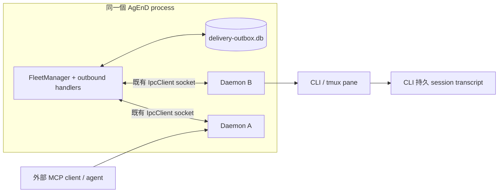

# #929 Durable Outbox 設計

**狀態：設計稿，尚未實作。**
**設計基準：** `origin/main` `da83161e369c9312f3e4772a5457c50c3f5d43a2`；FleetManager 與 instance daemon 由同一個 AgEnD Node process 管理。
**範圍：** #926、#927 與 FleetManager 接受的 agent-directed delivery；不包含本文件明列的 non-durable `raw_paste`。

## 決策摘要

1. 在 FleetManager process 內新增單一 SQLite durable outbox。row commit 才能回覆 durable accepted；`events.db` 不作工作佇列。
2. FleetManager 和 `Daemon` 物件不是兩個獨立 process。`delivery_begin`、`delivery_abort`、delivery ACK 由同 process 直接呼叫 outbox，SQLite commit 完才返回；IpcClient/socket write 只負責既有 ingress/target 通訊，絕不代表投遞完成。
3. 穩定 `delivery_id` 貫穿接受、dispatch、CLI header、status 與 reconciliation。MCP tool invocation 有獨立 `operation_id` 作冪等/查詢鍵；`correlation_id` 只關聯工作，可對應多筆合法訊息。
4. Fleet process 整體死亡後，先以 CLI 持久 transcript 中的 marker reconciliation；在任何舊 tmux window 被 kill 前，保存可用的 pane 證據。沒有正面或可靠負面證據才標 `uncertain`，不可盲目重送。
5. begin 對 `(delivery_id, target_daemon_boot_id, attempt_no)` 冪等。side effect 尚未發生且能證明未發生時，必須以 `delivery_abort` 持久退回 queued/retry_wait。
6. queue admission、completion、failure 均 fail-closed 並有機器可查/人可見結果。status reaction 由 outbox row 狀態驅動；retry_wait 不顯示失敗。

## 1. 現況與實際失敗邊界

### Process 與訊息路徑

FleetManager 和多個 `Daemon` instance 都在**同一個 AgEnD OS process**。例如 `instance-lifecycle.ts` 建立 `new Daemon(...)`，FleetManager 經 `IpcClient` 連 daemon 的 Unix socket；該 socket 是同 process 元件間的現有通道，不代表 daemon 是另一個會獨立崩潰的 OS process。CLI pane/程序及外部 MCP client 才是獨立 process。



`send_to_instance` 與 `report_result` 的目前路徑：外部 MCP client → `mcp-server.ts` → source `Daemon` tool handler → `fleet_outbound` IPC → FleetManager `sendToInstance()` → 記憶體 `deliverCrossInstanceWithRetry()` → target `deliverToInstance()`/daemon socket → target `pushChannelMessage()`、`pasteLock`、readiness gate → CLI paste/Enter。`report_result`、`delegate_task`、`request_information` 透過 wrapper 使用同一 outbound handler。`broadcast` 對每個 target 各排一個記憶體工作。

目前會靜默遺失或留下模糊結果的點：

- **整個 AgEnD process 死亡（#927 主場景）**：FleetManager、所有 daemon 物件、`deliverCrossInstanceWithRetry()` promise、每個 target 的 IPC/idle tails、`pasteLock` 都一起消失。已回覆 queued 的記憶體工作沒有重播來源。
- **同 process 單一 Daemon 物件 stop/restart**：FleetManager 與 store 可存活，但該物件的 queue/epoch/鎖和 socket 失效。replacement daemon 是新物件，舊物件的遲到 callback/ACK 不能改新 generation 的 row。
- **FleetManager 直接 socket write 回 true**只證明 bytes 被本機 socket 接受，不代表 target parse、入 queue 或 CLI 收到。若 write 後 process 死，無 message-level ACK 可恢復。
- target daemon 收到 `fleet_inbound` 後，到 CLI submission proof 之間的 queue 只在記憶體；busy/idle wait、retry state 及最終 result 沒持久化。target/整個 process 結束時無法知道 message 是否已 paste。
- tool timeout/disconnect 會回 tool error，但若 FleetManager 已接受或 CLI 已提交，結果可能未知。agent 重新呼叫工具時是新 tool call、新 `fleetRequestId`，目前沒有任何 source key 可將它認成同一個意圖。
- `cross_instance_delivery_failed` 及回送 sender/topic 的通知依賴仍存活的 daemon、IPC 和 adapter；通知丟失最多留下 log。`events.db` 是可重建/可 prune 的 history，不是工作真相來源。
- `report_result` 的 correlation 可省略且非唯一；同一 correlation 下可能有多筆 progress/final report，不能用它當 delivery primary key。
- FleetManager 重啟時 `Daemon.start()` 會建立新 tmux window 並清理舊 window（目前 Strategy A）。因此重啟後的新 pane 不一定含舊畫面；只查新 pane scrollback 幾乎總是無證據。

### 其他 agent-directed 路徑

一般 topic inbound、web/API inbound、schedule trigger 也進 `deliverToInstance()`；delivery status event 有時早於 CLI submission。silent schedule `raw_paste` 目前直接 IPC，不經 facade。所有路徑須由下方 policy map 明列，不能因共用「送訊息」字樣而隱式落入 outbox 或假稱 durable。

## 2. Store、key 與狀態模型

### 持久化選擇

使用獨立 `delivery-outbox.db`，位於 AgEnD `DATA_DIR`（預設 `~/.agend` 或 `$AGEND_HOME`），以既有 `better-sqlite3` 由 FleetManager 單一 writer 管理。設定 `journal_mode=WAL`、`synchronous=NORMAL`、短 `busy_timeout`，database/目錄沿用私有權限，DB transaction 同步且短；禁止 transaction 期間等待 IPC、idle、sleep 或 adapter。

WAL + NORMAL 在**AgEnD process crash/restart**時保有已提交 transaction；OS crash/斷電時，最近 commit 可能尚未 fsync 到穩定媒體。若需求包含斷電後也不得丟已 ACK 的 admission，需選擇 admission transaction 使用 FULL，並驗證 SQLite/volume 實際同步語意。壓測需記錄每 delivery 的 transaction/同步次數、commit p50/p95/p99、event-loop stall 和 WAL checkpoint 時間。不要用 `events.db`（損毀時可重建且會 prune）或 `scheduler.db`（不同 schema/責任）作真相來源。

DB 開啟/寫入失敗、磁碟滿或 schema 不相容時，不可 fallback 到記憶體 queue 並回 `queued:true`。拒絕新 durable admission、保留 DB/WAL、發 fleet alert；未完成 row 不自動刪除或 reset。

### 建議 schema

`deliveries` 每個 target/action 一列；broadcast 拆成每個 target 一列：

| 欄位 | 用途 |
|---|---|
| `delivery_id TEXT PRIMARY KEY` | Fleet 接受時產生 UUID，重試/replay 不變；同時放入 CLI envelope header。 |
| `operation_id TEXT` | 同一 MCP tool invocation 的穩定鍵；同一次 invocation 的 transport 重試沿用。 |
| `source_key TEXT UNIQUE` | 由穩定 ingress key + target 導出；不可用 correlation 或單次 transport `fleetRequestId` 取代。 |
| `source_instance`, `source_session`, `target_instance`, `target_session` | source/target 路由與通知位置。 |
| `source_daemon_boot_id`, `target_daemon_boot_id` | UUID；每個 Daemon 物件建立時新值。ACK 只可由當前 target generation 完成。 |
| `kind`, `request_kind`, `correlation_id`, `source_message_key` | exhaustiveness/status 關聯欄位；correlation 可空、非唯一。 |
| `payload_json` | 已完成定址、附件物化、含 delivery marker 的可重播 envelope。 |
| `state`, `attempt_no`, `created_seq` | row 狀態、attempt 和全域 admission 順序；target FIFO 再按 seq 排序。 |
| `manager_boot_id`, `lease_target_boot_id` | 記錄目前 dispatcher process 與 Daemon 物件 generation，不用時間推算租約存活。 |
| `expires_at` | 可選的產品 TTL；只可觸發可見 terminal failure，不得用來偷回收活躍 lease。 |
| `created_at`, `accepted_at`, `submitted_at`, `finished_at`, `updated_at` | audit/延遲觀測。 |
| `last_error_phase`, `last_error_code`, `last_error_safe` | 不含 token/secret/完整附件的診斷。 |
| `notification_state`, `notice_attempts` | failure notice 是否已持久排出/成功通知。 |

另設 `delivery_attempts` append-only log，記錄 `(delivery_id,target_daemon_boot_id,attempt_no)`、begin/abort、submission evidence 和結果。`delivery_id` 對每個三元組有唯一約束；begin 重入讀回相同 permit/ack，不可再增加 attempt 或 side effect。

### 冪等鍵與重送邊界

`operation_id` 必須在 source 端建立並放在 tool invocation 中，供呼叫方在 timeout/process crash 後仍可查詢；若 MCP transport 有明確保證會在同一呼叫重試時沿用的 call ID，可用該 ID 加 source namespace，否則由 caller 提供/保留 UUID 欄位。source daemon 的 `fleetRequestId` 只作單次 IPC request 去重，不可當跨 MCP retry 的 operation key。`source_key = source_namespace + operation_id + target_instance + action_kind`。同一 operation_id 的重送回既有 row；每個新的模型/tool invocation 都是新的操作；同 correlation 可有多個 key/row。為相容，舊 caller 暫時省略 operation_id 時 server 可建立 UUID，但必須在所有 timeout/error/success response 回傳；此模式若 process 在 response 前死亡，client 未取得該 UUID，不能宣稱可跨新 tool call 去重。穩定 operation_id 是完整 response-loss 保證的前提。

timeout 回覆不得只寫「failed」：若 admission/side effect 可能已發生，回 `outcome_unknown`，帶原 request 的 `operation_id`，明確指示**先查狀態，不要重送原工作**。新增 read-only `delivery_status` 查詢，接受一個 `delivery_id`、`operation_id` 或 `correlation_id`；operation_id 對應此 invocation 的 target rows，correlation_id 可回多筆。若模型仍建立一個新的 tool call，它是新的操作，不可僅靠語意相似度去重。相同 transport invocation 的自動重試會因 operation_id 回既有 row。

平台 event 用 `(adapter_id, platform_message_id, target, action_kind)`；schedule 用 `(schedule_id, run_id, target)`；內部 system notice 用來源 event UUID。source key 都保留 target/action 維度，避免把合法多 recipient 或不同 action 合併。

### 狀態與持久 side effect

```text
queued → delivering → retry_wait → queued
                   ↘ failed
                   ↘ submission_started → delivered
                                        ↘ failed       (可靠 negative proof)
                                        ↘ uncertain    (結果無法判定)
queued/delivering → cancelled           (明確取消)
submission_started → queued/retry_wait  (僅 delivery_abort 證明尚未 side-effect)
```

- `queued`：payload 已 commit；可回 durable acceptance。
- `delivering`：dispatcher 已選取 row；lease 身份是 `(manager_boot_id,target_daemon_boot_id)`。不得因 wall-clock 經過而被另一 worker 佔用。
- `submission_started`：target 在 pane side effect 前直接呼叫同 process outbox `begin()`。交易先 commit，回傳與 `(delivery_id,generation,attempt_no)` 綁定的 begin permit；沒有 permit 就不能 paste/Enter。
- 重複 `begin()` 對同一三元組回傳既有 permit，不重複轉狀態或增加 attempt。舊 generation/attempt 不得取得新 permit。
- `delivery_abort()` 只允許 side effect 尚未發生且呼叫方能證明未寫 pane（例如 under-lock recheck 發現 generation/cancel/readiness 改變，或可靠的 write 前錯誤）。在同一 transaction 記 abort proof 並回 `queued`/`retry_wait`；相同 abort 冪等。若是否已 paste 不確定，不能 abort，必須 reconciliation/`uncertain`。
- `delivered`：只在同 `delivery_id`、目前 Daemon boot id 的 positive submission proof 已同步持久寫入後成立。`socket.write()`、`fleet_inbound` 收到或 begin permit 都不是 delivered。
- `retry_wait`：可證明尚未 side effect 的 transient failure；保留原 ID/order。它與 queued 一樣仍是 pending。
- `failed`：永久錯誤或明確 TTL/重試政策耗盡，且已停止舊 worker；failure notice row 持久化。
- `uncertain`：submission 可能已發生但 transcript/保存證據無法判定；不自動重送，顯示可能已投遞並提供 inspect/manual replay。
- `cancelled`：明確取消尚未提交工作；正常 Fleet/process/target restart 不等於取消。

### Generation 與 lease

FleetManager process 每次啟動產生 `manager_boot_id`；每次 `Daemon` 物件建立產生 `target_daemon_boot_id`。全 process 死亡時所有 daemon generation 一起消失；單一物件重啟時只有該 target generation 改變。舊物件/舊 socket callback 的 ACK 以 generation fencing 拒絕。

不設 `lease_until` wall-clock 自動回收。idle/readiness 等待可能合法超過 30 分鐘，時間流逝不能證明舊 worker 已停止。process boot 變更時，舊 manager lease 可回收；單一 target generation 改變時，只回收該 generation 尚未 submission 的列，submission_started 先 reconcile。需要上限時採明確可見 `expires_at` policy：到期先 fence/cancel 原 worker、再持久轉 failed 並發 notice，不可以讓新 worker 對仍可能生效的舊 side effect 搶 lease。

## 3. 重啟、replay 與 reconciliation

### 真實 crash matrix

| 故障點 | 整個 AgEnD process 重啟 | 單一 Daemon 物件 restart |
|---|---|---|
| durable insert 前 | 不存在 row；source 收同步 error 或 outcome_unknown 後以同一 `operation_id` 查/重試 | 同左；FM/DB 仍活著，IPC error 明確回 source |
| queued commit 後、target effect 前 | 新 FM 開 DB，恢復 queued；所有 daemon generation 改新值 | FM/其他 daemon 不變；replacement target generation 改新值，該 target queued row replay |
| begin commit 後、pane write 前 | 重啟前證據流程；若證明未寫可 abort/requeue，否則 reconciliation | 先停止/fence 舊 Daemon；舊物件可靠證明未寫才 abort，否則保存證據並 reconcile |
| pane write 後、delivered commit 前 | transcript marker / pre-kill pane evidence 查找；正面命中→delivered；模糊→uncertain、不重貼 | 舊 generation ACK 即使遲到也拒絕；replacement 同樣 reconcile，不能假設 pane 一定沿用 |
| delivered commit 後、工具 response 前 | row 仍 delivered；status 查詢可回結果，不能建第二 row | 同左，且舊 callback 冪等 |
| failure notice 中途 | notice row 獨立 replay；notice failure 不產生新 notice | 同 process dispatcher 可續送；接收 Daemon 換代需重新查路由 |

所有 crash-matrix 測試都必須殺掉並重新啟動**整個 AgEnD OS process**（不是只重建 store mock/單一物件），重新開 SQLite connection、重建 FleetManager 和所有 `Daemon` objects，並驗證 restart 清掉舊 tmux window。單 Daemon restart 是另一組獨立測試。

### Evidence-first recovery

1. CLI message envelope 開頭加入短、可精確匹配且不影響 agent 任務內容的 marker，例如 `[agend-delivery-id:<UUID>]`。marker 必須跟實際提交到 CLI 的同一段內容一起進 session transcript；不能只存在 IPC metadata。
2. 首選查 CLI 自己持久化的 transcript：Claude Code JSONL、Codex rollout 等既有 transcript source，依 session ID 搜尋完整 delivery marker。正面命中是 delivered proof。讀取不完整/不可用時，不能把「沒搜到」當 negative proof。
3. 在任何 daemon startup/restart 的 `killWindow` / `new-window` cleanup 前，先 capture 舊 pane，針對未完成 `submission_started` rows 擷取與 delivery marker 對應的最小 evidence metadata（window identity、marker hit、capture 時間/完整性）；避免保存完整敏感 pane。整 process restart 也必須在 lifecycle 刪舊窗前完成這一步。
4. 若 transcript 有完整覆蓋且 marker 不存在，或 pre-kill evidence 可靠證明尚未寫入，才可判 negative proof 並 abort/retry。若 pane 已換、transcript 缺段、session identity 不確定或 capture 不完整，標 uncertain 並通知，不盲貼第二次。
5. 維持 `delivery_id` 到 human delivery status event / failure notice 的 mapping。證據來源不只 pane；pane 只是在舊窗被清除前的輔助存證。

## 4. Dispatch、failure surface 與順序

1. FleetManager 啟動先 open/validate DB，載入舊 rows，完成 recovery classification，再開 dispatcher/adapter 的不可逆 ingress ACK。啟動恢復期間可以把新 ingress durable insert 入列，但 dispatcher 先處理舊 pending rows。
2. `created_seq` 由 DB 單調遞增。每個 target 嚴格按 seq FIFO，且同 target 最多一筆 in-flight；恢復 rows 排在 process restart 後的新 ingress 前。不同 targets 有 bounded parallelism，不能為 FIFO 將全 fleet 串行化。
3. 正常 message、cross-instance、`report_result`/wrappers、broadcast recipient、web/API、schedule trigger、system notices 都經共用 admission/dispatcher。
4. `steer` 與 `btw` 必須在 exhaustiveness policy map 明列，保持既有操作模式、target 定址及 side-effect semantics；若它們觸發 agent-visible action，就各自有 delivery row/attempt，但不把兩種 action 折疊成普通 message。沒有明確 policy 的新 outbound kind 在 typecheck/test 中 fail。
5. silent schedule `raw_paste` 第一版明確是 **non-durable**：不得回 `durable:true`/`queued:true`，CLI/API 回應標示 `durable:false, delivery_state:"non_durable"`，並記錄 follow-up 接線需求。其他 control-plane IPC（status query、setting、tool result response）不是 agent-directed delivery，也不進 outbox。
6. 經 MCP admission：DB commit 後 response 帶 `durable:true`, `delivery_id`, `operation_id`, `delivery_state:"queued"`；`sent` 舊欄位若保留，文件與工具描述都解釋它只代表 durable accepted，不是 agent read/processed。
7. DB insert 失敗時同步拒絕，不以 RAM fallback 假成功。socket disconnect / IPC response timeout 在 operation 可能已接收時回 `outcome_unknown` + operation_id/status 查詢方式，禁止暗示確定失敗或要求盲重送。
8. `failed` 與 `uncertain` 有持久可查狀態，並各有明確通知。確定 failed 的 terminal transition 與建立 failure-notice row 在同一 DB transaction commit，避免狀態已失敗但 notice 未入列。notice 是帶 `parent_delivery_id` 的獨立 row；notice delivery 失敗只更新自身狀態，不建立另一個 failure notice，防止遞迴。
9. Discord/TG reaction 和其他 status surface 僅由 row state transition 產生且需 idempotent：queued/delivering/submission_started/retry_wait 保持處理狀態（例如 ⏳/👀）；retry_wait 不發 ❌/👎；delivered/confirmed 顯示成功；只有確定 terminal failed 才顯示 ❌/平台合法失敗 emoji；uncertain 顯示中性明確通知，不偽裝成成功/失敗。adapter 更新失敗不回滾 row。
10. `cross_instance_delivery_failed` 改成 outbox terminal transition 的投影事件，不再是唯一 failure truth。sender/topic/operator notification 暫時失敗時，row 和 notice queue 留存；可由 `delivery_status` 或 `agend delivery list|show|retry` 查到。retry 必須審計且保留原 row 歷史。

過期上限、全域 worker 數、per-target queue bytes/count、terminal retention 等具體值，先用約 30 targets 壓測決定。超 TTL 的 row 必須讓原 worker 被 fence 後可見地 failed；不可只從 queue 消失。

## 5. 現有 API 整合、相容與遷移

- `send_to_instance`、`delegate_task`、`request_information`、`report_result` 維持 schema/wrapper，新增 operation/delivery IDs 與 durable state。`report_result` 的 correlation optional 保持相容並繼續 warning；correlation 不作去重。
- `broadcast` 每個 target 各自 admission、FIFO 和 status；一個 target failure 不吞掉其他結果。
- target 正在 planned restart/replacement 時仍可 durable admission，row 等待 replacement Daemon generation ready 後按 FIFO dispatch；只有真正 stopped/unknown 且沒有 restart intent 的 target 才走既有同步拒絕。restart intent 及 queued admission 的 race 由 FleetManager 同一 transaction/狀態 gate 線性化，避免把短暫 restarting 誤認 permanently unavailable。
- 平台/web/API ingress 必須在 source ack/offset advance 前 durable insert。逐 adapter 審核其可重送/ack contract；若 provider 在本機 commit 前已不可逆 ack，該 ingress gap 必須明列，不能承諾無遺失。
- schedule 用穩定 schedule/run key 去重；`raw_paste` 是上節定義的 non-durable 第一版例外。
- 新增只讀 `delivery_status` tool/query：必須能以 operation ID 回覆 response-lost 的那筆狀態；correlation 查詢允許多列。其本身是 control-plane，不建立 outbox row。
- 加 versioned `delivery_ack_v1` capability handshake。target daemon 只有宣告支援且送回 matching delivery ID + current generation 的 ACK 才能完成 row。缺 capability 的舊 daemon 必須進 compatibility error/degraded failed，絕不可當 delivered。
- wire fields additive/optional；新版本啟動順序是開 store → preflight evidence → recover/分類舊 rows → 開 dispatcher → 啟用會 ack 的 ingress。既有記憶體 queue 無法回填，升級切換瞬間仍有舊版風險需揭露。
- 附件在 admission 前必須物化到 outbox-owned blob area 並以 delivery ID 引用；不能存過期 CDN URL/process temp path。terminal retention 後安全 GC。
- 新 DB 用 `PRAGMA user_version` additive migration；不改 events/scheduler schema。成功 payload 建議 7 日清內容、terminal metadata 30 日保留；unfinished/uncertain/notice rows 不自動 prune。

## 6. 失敗處置與 rollback

1. **Canary/flag：** 可逐步啟用 admission/dispatcher，但任何未啟用/故障 fallback 必須標 `durable:false` 並明確通知；不可以悄悄回到記憶體 queue 後仍回答 queued。
2. **關閉 dispatcher：** 暫停新 durable admission、列出 pending/uncertain/notice count，依 policy 凍結未完成項。不得批次標 delivered 或刪除 rows。
3. **退回舊版：** 保留獨立 DB/WAL；舊版不讀它時，顯示 pending rows 數量與 recovery 操作說明。回到新版先 inspect/reconcile 再 replay，避免重複投遞。
4. **migration/store failure：** 不做 destructive down migration；用 SQLite backup API 取得一致備份並記錄 user_version。migration/DB failure fail-closed、保留原檔與 WAL，不自動搬走重建空 DB。
5. **dispatcher bug：** 舊 manager/generation fencing 後按 transcript/evidence reconcile。submission_started 不可一鍵全部 queued；uncertain 必須逐筆人工 inspect/replay 並留審計理由。
6. **容量保護：** 設 pending count/bytes 上限；達上限拒絕新 admission、告警但保留舊 work。只清可 prune 的終端 payload，不 prune 未完成列。

## 7. 測試策略與必紅 mutation

### 必測情境

- Store/schema：原子 insert/transition、duplicate keys、begin/abort idempotency、commit throw、reopen/WAL、busy/full/corrupt fail-closed、migration repeat。
- **真 process crash integration harness：** 在子 process 中啟動真 FleetManager + 多個 `Daemon` objects，使用臨時 DATA_DIR/SQLite 和可跨 process 保存狀態的 tmux/CLI fixture。每個 crash point 將整個 AgEnD 子 process `SIGKILL`，再以全新 PID 重啟（新 DB connection、FM、所有 Daemon objects），並驗證 startup kill 舊 window 前執行 capture、之後舊 window 確實消失。只重建單一 class/mock 不算 crash-matrix coverage。
- 全 process crash 後 queued row replay、已 delivered row 不重送、response-lost 由同 operation_id 查得狀態；target object restart 僅換 target generation，舊 generation ACK 被拒。
- begin commit → pane write 前 crash：負面 proof/abort 才可 replay；pane write 後 ACK 前 crash： transcript marker 正向命中標 delivered；證據不可用則 uncertain 且只送一次。
- transcript reconciliation 必須測 Claude JSONL/Codex rollout marker、session identity、截斷 transcript 和 pre-kill pane capture；無完整證據不能把 absence 當 negative。
- #927 busy target 多訊息順序 replay；#926 report_result 到 leader success/failure 都能查、對回 correlation，pipeline 不會靜默卡住。
- timeout/outcome_unknown/status lookup、不同 tool invocation 不被誤合併、相同 operation transport retry 不重複；同 correlation 多筆 report 都保留。
- recovery rows 排在 restart 後新 ingress 前；同 target 並發仍 FIFO/單 in-flight，不同 targets bounded parallel。`steer`/`btw` policy 覆蓋；unknown kind 明確測試失敗。
- restarting target 可接 durable ingress 並等 replacement generation；真正 stopped/unknown target 按 policy 同步拒絕或持久 failed。
- notice 自己重啟後能續送；notice failure 不遞迴。reaction 由 DB state 驅動且 retry_wait 不顯示 failure；`raw_paste` 明確回 non-durable。
- 30 target 壓測：throughput、commit p50/p95/p99、fsync/commit 次數、WAL checkpoint、event-loop stall、不同 target 並行與單 target HOL blocking。
- 每一種 outbound/action 由 exhaustiveness map 指定 durable policy、marker/header policy、ACK/evidence policy、status mapping；新增型別缺一項就 typecheck/test fail。

### 必須能抓到的 mutation

1. 移除 outbox insert，或把 commit 移到 `durable accepted` response 後：全 process crash-after-accept 後 row 消失，測試紅。
2. 把 socket write/`fleet_inbound` 收到當 delivered：target crash/no ACK 測試紅。
3. restart 不 recover process boot 舊 lease或不重啟 queue pump：全 process 重啟後 pending stuck，測試紅。
4. 每次 retry 產新 delivery ID、移除 source-key unique guard 或把 correlation 當 unique：重送/同 correlation 多列測試紅。
5. 接受舊 target generation ACK：舊 Daemon socket/遲到 ACK 完成 replacement row，generation-fence 測試紅。
6. 將所有 `submission_started` 自動 replay：write-after-crash/no-ACK 測試紅，預期一次 side effect + uncertain。
7. 刪掉 failure/uncertain row，或只有 log/eventLog 而無 durable notice/status：#926 operator visibility 測試紅。
8. notification reject 被吞但 `notification_state=sent`：notice retry/restart 測試紅。
9. correlation_id 作唯一鍵：同 correlation 的兩個 report 被合併，測試紅。
10. 移除 delivery ID 到 status/failure mapping：exhaustiveness/per-message status 測試紅。
11. target 在沒有已 commit 的 begin permit 前 paste/Enter：同 delivery 重複/無 submission fence 測試紅。
12. begin 重入不冪等，或拿掉安全 `delivery_abort`：duplicate begin 改變 attempt、或 write 前 abort 留下假 submission_started/uncertain，測試紅。
13. dispatcher 在 recovery scan/classification 前消費新的 ingress：舊 row 被新 row 越過，FIFO 測試紅。
14. 拿掉 per-target single-flight：兩筆同 target 同時 begin/write 或順序顛倒，併發 FIFO 測試紅。
15. DB throw 時 fallback 到記憶體並回 `queued:true`：fail-closed admission 測試紅。
16. prune 清掉 queued/delivering/submission_started/retry_wait/uncertain/未送 notice：未完成 row 消失測試紅。
17. failure notice 自己失敗又產生新的 failure notice：遞迴被界限測試紅。
18. target 沒有 `delivery_ack_v1` capability 仍被標 delivered：舊 daemon handshake 測試紅。
19. 移除 envelope 的 delivery marker：整 process crash、舊 window 被清掉後，Claude/Codex transcript reconciliation 找不到已提交工作，預期 delivered 的測試轉紅。

Unit tests 可覆蓋 deterministic state transitions，但不得代替上列 process-level crash tests。

## 設計 review 拍板項

1. 第一版涵蓋所有 `deliverToInstance()` agent-directed payload；`steer`/`btw` 納入明確 policy map，silent `raw_paste` 是有標示的 non-durable 例外。
2. Evidence-first：marker transcript + pre-kill capture 後仍不能判斷才 `uncertain` + 人工；不承諾 exactly-once，也不盲重播。
3. timeout 回 `outcome_unknown` + operation_id/status lookup；同 invocation transport retry 冪等，新模型/tool invocation 是新意圖。
4. lease 不用 wall-clock 過期偷回收；若設 TTL，明確 fence 舊 worker 後轉 visible failed。
5. WAL/NORMAL 保障 process crash durability；OS crash/斷電的最近 commit 風險明列，是否 admission 使用 FULL 由壓測/產品保證拍板。
6. DB failure fail-closed；30-instance 壓測後定 max age、worker concurrency、容量和 retention。
